
| Name | NRP | Class |
| ---- | --- | ----- |
| Joaquin Fairuz Nawfal Ismono  | 5025241106 | A |

## Task 1

- Flag

  `JARKOM25{Ja0G_Bbbb4ng3t_S1_NN7O22DL5T1H751GK2Y3M2YYVUQQC90xl0vel1v9xrlhxth3kcz7vy522vbb7_e91add39c05702586b380eec9179ef19}`
  
  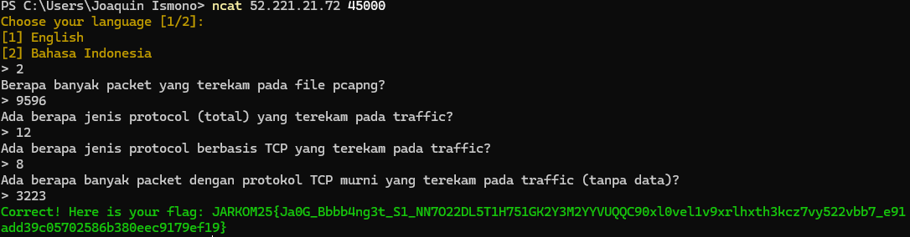

> a. Berapa banyak packet yang terekam pada file pcapng?

> _a. How many packets are recorded in the pcapng file?_

**Answer:** `9596`

- Filter expression

  `-`

- Explanation

  `Tidak memerlukan sebuah filter untuk melihat total packet yang terekam, cukup melihat pada bar di bawah yang bertuliskan "Packets: "`

- Output result

  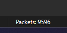

 
 

> b. Ada berapa jenis protocol (total) yang terekam pada traffic?

> _b. How many types of protocol (totals) are recorded in the traffic?_

**Answer:** `12`

- Filter expression

  `-`

- Explanation

  `Untuk menjawab soal ini, hanya perlu buka halaman Statistics -> Protocol Hierarchy. Disana kita bisa melihat ada berapa jenis protocol yang ada.`

- Output result

  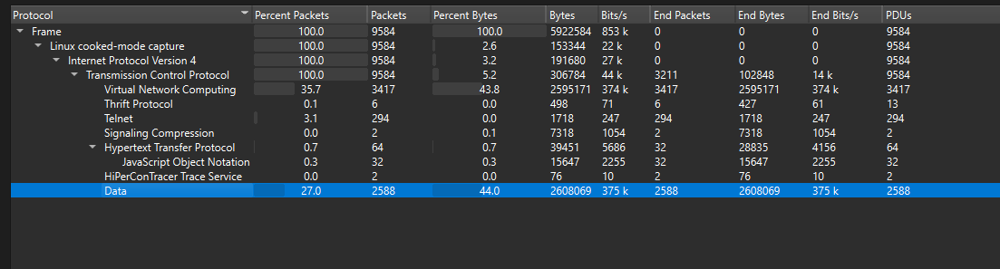

 
 

> c. Ada berapa jenis protocol berbasis TCP yang terekam pada traffic?

> _c. How many types of TCP-based applications protocol are recorded in the traffic?_

**Answer:** `8`

- Filter expression

  `-`

- Explanation

  `Sama seperti soal sebelumnya (1-b), hanya perlu membuka Protocol Hierarchy dan hitung ada berapa jenis protokol di bawah list Transmission Control Protocol.`

- Output result

  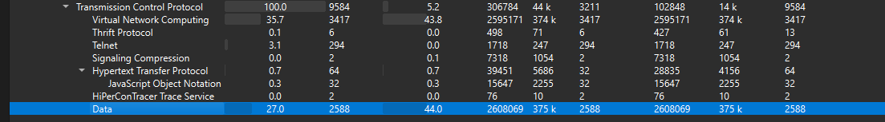

   
   

> d. Ada berapa banyak packet dengan protokol TCP murni yang terekam pada traffic (tanpa data)?

> _d. How many packets with pure TCP protocol are recorded in the traffic (without data)?_

**Answer:** `3223`

- Filter expression

  `!data and _ws.col.protocol == "TCP"`

- Explanation

  `Filter "!data" mem-filter keluar semua packet yang berisi data. Lalu, filter "_ws.col.protocol == "TCP"" mem-filter keluar semua packet dengan protocol bernama "TCP"`

- Output result

  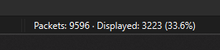

## Task 2

- Flag

  `JARKOM25{N1c3_0ne_b4nggg_VKJAULQMZOyuMM13yynuycuuyutlijuygrpjrc3r4t0ps57851356591097957151_4d8f0043e5b56cc5bef87cadd916b988}`

  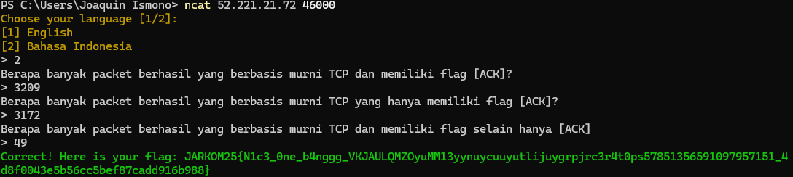

> a. Berapa banyak packet berhasil yang berbasis murni TCP dan memiliki flag [ACK]?

> _a. How many packets succeed that are pure TCP based and have [ACK] flag?_

**Answer:** `3209`

- Filter expression

  `_ws.col.protocol == "TCP" and !data and tcp.flags.ack ==  1 and !tcp.analysis.flags`

- Explanation

  `2 filter pertama sudah dijelaskan di task sebelumnya. Filter "tcp.flags.ack ==  1" digunakan untuk memfilter yang memiliki flags [ACK], lalu filter "!tcp.analysis.flags" digunakan untuk memfilter semua paket yang berhasil.`

- Output result

  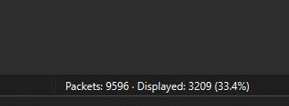

   
   

> b. Berapa banyak packet berhasil yang berbasis murni TCP yang hanya memiliki flag [ACK]?

> _b. How many packets succeed that are pure TCP based and have only [ACK] flag?_

**Answer:** `3172`

- Filter expression

  `_ws.col.protocol == "TCP" and !data and tcp.flags.ack ==  1 and !tcp.analysis.flags and !tcp.flags.syn == 1 and !tcp.flags.push == 1 and !tcp.flags.fin == 1`

- Explanation

  `filter awal sama seperti soal 2-a, dengan tambahan filter agar memfilter keluar semua packets yang mempunyai flags selain [ACK]`

- Output result

  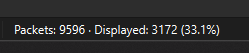

   
   

> c. Berapa banyak packet berhasil yang berbasis murni TCP dan memiliki flag selain hanya [ACK]?

> _c. How many packets succeed that are pure TCP based and contain flags other than just [ACK] flag?_

**Answer:** `49`

- Filter expression

  `(_ws.col.protocol == "TCP" and !data and !tcp.analysis.flags) and ((tcp.flags.ack == 1) and tcp.flags.syn == 1 or tcp.flags.push == 1 or tcp.flags.fin == 1 or tcp.flags.ack == 0)`

- Explanation

  `Modifikasi filter dari soal 2-b, di kondisi filter setelah 'and' akan memfilter packets yang mempunyai flags [ACK] dan flags lainnya, atau packets yang tidak mempunyai flags [ACK]`

- Output result

  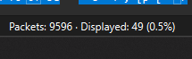

   
   

## Task 3

- Flag

  `JARKOM25{W0W_Y0uU_h4V33e_d0n3_444_90od_j0bB_VXIZIg0dl1k35fompr82a8vvzztsdbqqnw_1ef39d54536443cb1e2ef1b51161c9bd}`

  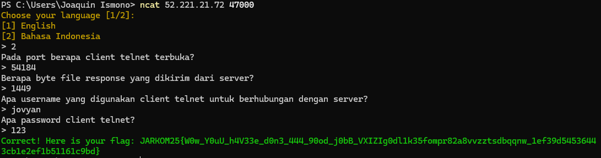

> a. Pada port berapa client telnet terbuka?

> _a. In what port is the telnet client open?_

**Answer:** `54184`

- Filter expression

  `tcp.flags.syn == 1`

- Explanation

  `Filter diatas digunakan saat host memulai koneksi ke host lainnya. Lalu, sort "Destination" yang berbeda sendiri agar bisa menemukan Source Port telnet.`

- Output result

  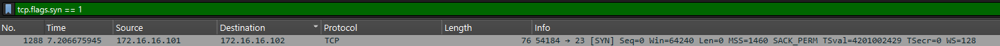

   
   

> b. Berapa byte file response yang dikirim dari server?

> _b. How many bytes of the response files are sent from the server?_

**Answer:** `1449`

- Filter expression

  `tcp.flags.syn == 1`

- Explanation

  `Klik kanan pada packet yang dipilih pada task 3-a, lalu Follow -> TCP Stream. Karena yang dibutuhkan hanya size yang dikirim dari server, maka pilih file yang dikirim dari server ke user.`

- Output result

  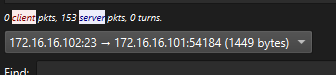

   
   

> c. Apa username yang digunakan client telnet untuk berhubungan dengan server?

> _c. What telnet client's username is used to connect with the server?_

**Answer:** `jovyan`

- Filter expression

  `-`

- Explanation

  `Lanjutan dari task 3-b, kita bisa melihat username dari isi stream tersebut.`

- Output result

  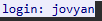

   
   

> d. Apa password client telnet?

> _d. What is the telnet client's password?_

**Answer:** `123`

- Filter expression

  `-`

- Explanation

  `Karena input password di ubuntu di hide pada user interface, maka lihat password dari user input/entire conversation.`

- Output result

  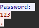

   
   

## Task 4

- Flag

  `JARKOM25{G04t__a4n4liz333er_WJLBE3TB101PZ6EZ7SXLfr0gol8sh40wwu0k260r3ys4534528863_1e6e2c9049018d026ebae8be3648ae8d}`

  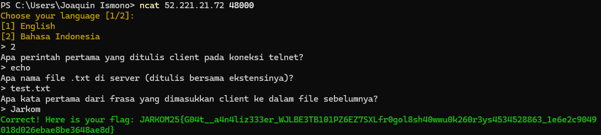

> a. Apa perintah pertama yang ditulis client pada koneksi telnet?

> _a. What is the first command that client wrote on telnet connection?_

**Answer:** `echo`

- Filter expression

  `tcp.flags.syn == 1`

- Explanation

  `Lanjutan dari soal 3-d, kita bisa melihat semua user input disana. Dan perintah pertama kali yang user tulis adalah "echo".`

- Output result

  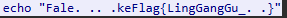

   
   

> b. Apa nama file .txt di server (ditulis bersama ekstensinya)?

> _b. What is the name of .txt file on the server (write with the extension)?_

**Answer:** `test.txt`

- Filter expression

  `tcp.flags.syn == 1`

- Explanation

  `Jika melihat stream payload yang diberikan oleh server ke user, bisa dilihat bahwa saat user memasukkan perintah "ls", terdapat file "test.txt".`

- Output result

  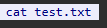

   
   

> c. Apa kata pertama dari frasa yang dimasukkan client ke dalam file sebelumnya?

> _c. What is the first word that the client inserted into the previous file?_

**Answer:** `Jarkom`

- Filter expression

  `-`

- Explanation

  `Terlihat bahwa client menuliskan perintah: echo "Jarkom Gampang" >> test.txt. Maka kata pertama adalah "Jarkom"`

- Output result

  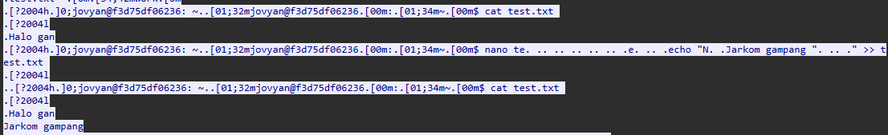

   
   

## Task 5

- Flag

  `JARKOM25{n4il0ng_m1lk_dr4g000n_BAPDLUPOKYNN0WEWQVEX0N3K42IGHNcr0c5q8xm19qd1emayijwtaob438_97b6de7e9774041a5053eef81d909ba8}`

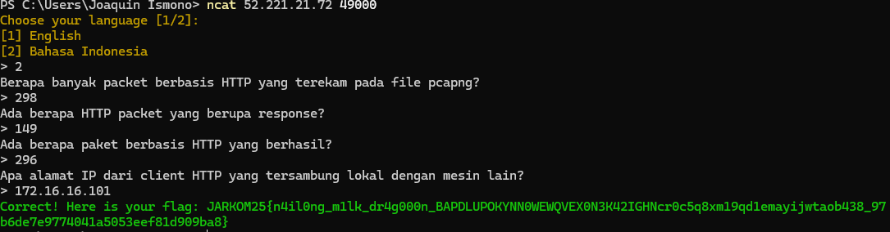
  
> a. Berapa banyak packet berbasis HTTP yang terekam pada file pcapng?

> _a. How many HTTP packets are recorded in the pcapng file?_

**Answer:** `298`

- Filter expression

  `http`

- Explanation

  `Filter akan menampilkan semua packet yang berbasis HTTP`

- Output result

  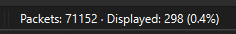

   
   

> b. Ada berapa HTTP packet yang berupa response?

> _b. How many response HTTP packets are recorded in the traffic?_

**Answer:** `149`

- Filter expression

  `http.response.code`

- Explanation

  `Filter diatas digunakan untuk memfilter packet http yang berupa response dari server`

- Output result

  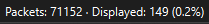

   
   

> c. Ada berapa paket berbasis HTTP yang berhasil?

> _c. How many HTTP packets that succeed?_

**Answer:** `296`

- Filter expression

  `http && !tcp.analysis.flags`

- Explanation

  `Sama seperti soal 2, hanya saja ini untuk filter packet berbasis HTTP.`

- Output result

  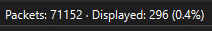

   
   

> d. Apa alamat IP dari client HTTP yang tersambung lokal dengan mesin lain?

> _d. What is the client HTTP IP Address in connection with other local machine?_

**Answer:** `172.16.16.101`

- Filter expression

  `http && ip.dst == 172.16.16.1`

- Explanation

  `Pakai filter diatas, lalu lihat alamat IP source.`

- Output result

  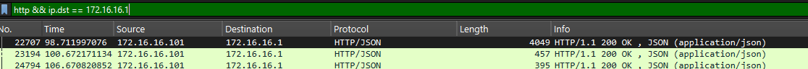

   
   

## Task 6

- Flag

  `JARKOM25{br0mb44rdin0u_Cr0ccc0c0c0cdi1l10l_8675844799awaesadw8gp0f7aash1n0buL477P8W61E462VO_9f58a7c1d9e03cb2209e72012f991713}`

  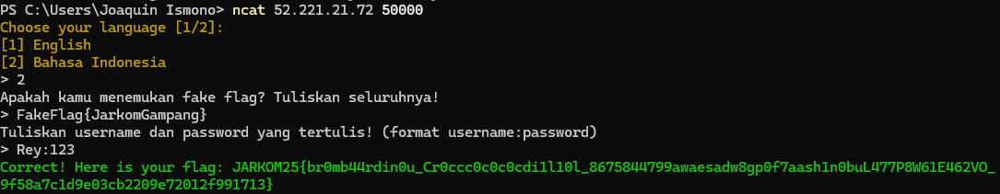

> a. Apakah kamu menemukan fake flag? Tuliskan seluruhnya!

> _a. Did you find the fake flag? Write it whole!_

**Answer:** `FakeFlag{JarkomGampang}`

- Filter expression

  `-`

- Explanation

  `Lakukan "Follow Stream" pada packets. Fake flag akan ditemukan pada stream 31 (terdapat dalam file flag.txt).`

- Output result

  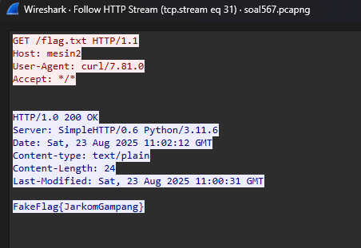

   
   

> b. Tuliskan username dan password yang tertulis! (format username:password)

> _b. Write the written username and password! (format username:password)_

**Answer:** `Rey:123`

- Filter expression

  `-`

- Explanation

  `Sama dengan 6-a, lakukan "Follow Stream" pada packets. Username dan password akan ditemukan pada stream 32 (terdapat dalam file passwd.txt).`

- Output result

  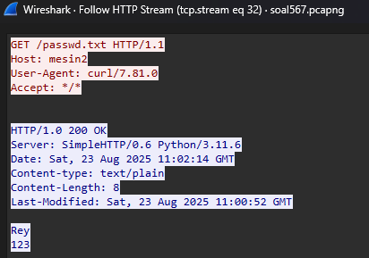

   
   

## Task 7

- Flag

  `JARKOM25{tr4l4lel0_tr1lil1_oxlo06x6y8k3b0s0sVUSYDJGZMDM8BRE_9085ba3db3fbfddf0a4aff216289082c}`

  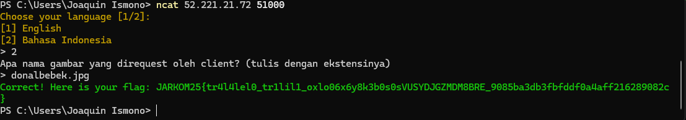

> Apa nama gambar yang direquest oleh client? (tulis dengan ekstensinya)

> _What is the image that is being requested by the client? (write with its extension)_

**Answer:** `donalbebek.jpg`

- Filter expression

  `http.content_type contains "image"`

- Explanation

  `Gunakan filter diatas, lalu lakukan "Follow Stream" pada salah satu packets. Akan ada perintah dari user untuk "GET /donalbebek.jpg".`

- Output result

  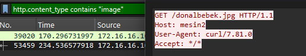

   
   

## Task 8

- Flag

  `JARKOM25{y0u_4r3_s0_G00d_1n_F0r3nsic_M4SMAEPZ5WVYFH5CZ6O0UXQBNIL2XMx45y4n6rznid5077a3v2lkigqvxaa2_7e6f0677dd8f32ec2ae167fa6a87dad2}`

  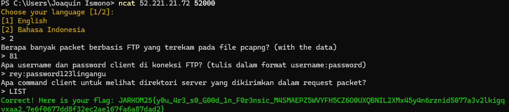

> a. Berapa banyak packet berbasis FTP yang terekam pada file pcapng? (with the data)

> _a. How many FTP packets are recorded in the pcapng file? (with the data)_

**Answer:** `81`

- Filter expression

  `_ws.col.protocol contains "FTP"`

- Explanation

  `Filter diatas digunakan untuk memfilter semua packet dengan nama protocol yang mengandung unsur kata "FTP".`

- Output result

  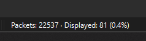

   
   

> b. Apa username dan password client di koneksi FTP? (tulis dalam format username:password)

> _b. What is the client's username and password in FTP connection? (write in following format username:password)_

**Answer:** `rey:password123lingangu`

- Filter expression

  `_ws.col.protocol contains "FTP"`

- Explanation

  `Menggunakan filter yang sama, kita bisa melihat username dan password client pada packets information.`

- Output result

  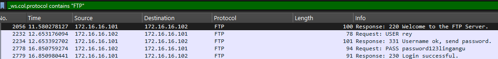

   
   

> c. What is the client's command for showing server directory that was sent on request packet?

> _c. Apa command client untuk melihat direktori server yang dikirimkan dalam request packet?_

**Answer:** `LIST`

- Filter expression

  `_ws.col.protocol contains "FTP"`

- Explanation

  `Pengerjaan sama seperti 8-b, namun carilah kata-kata "LIST" untuk melihat direktori (seperti di ubuntu "ls"). Isi dari direktori pun bisa terlihat jika menggunakan "Follow Stream" (Pada stream 11).`

- Output result

  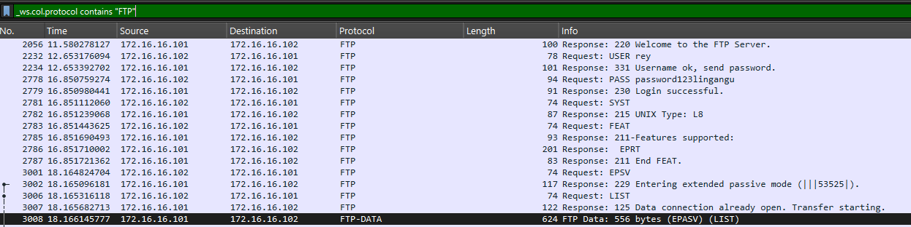

   
   

## Task 9

- Flag

  `JARKOM25{j4rk000000mmm_g4mpp4444n9999999_55152137138i41L4h1s28w5zke3321k0ncolDBVG8MLEUMYC6SH_dab715f7e7ec54cb8f5b2205c96db3b6}`

  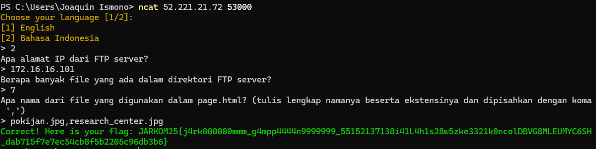

> a. Apa alamat IP dari FTP server?

> _a. What is the FTP server IP Address?_

**Answer:** `172.16.16.101`

- Filter expression

  `ftp.response.arg`

- Explanation

  `Gunakan filter diatas, lalu lihat IP source. Filter diatas digunakan untuk melihat semua packets yang merupakan respons dari server.`

- Output result

  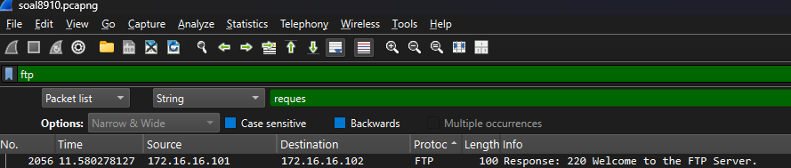

   
   

> b. Berapa banyak file yang ada dalam direktori FTP server?

> _b. How many files are there inside the FTP server directory?_

**Answer:** `7`

- Filter expression

  `ftp`

- Explanation

  `Cukup gunakan "Follow Stream" lalu semua file akan terlihat pada stream 11. Hal ini bisa dilakukan karena pengguna menggunakan perintah "LIST".`

- Output result

  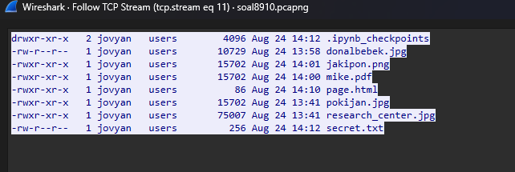

   
   

> c. Apa nama dari file yang digunakan dalam page.html? (tulis lengkap namanya beserta ekstensinya dan dipisahkan dengan koma ',')

> _c. What are the filenames used in the page.html? (write the filebames with their extensions and separate them with comma ',')_

**Answer:** `pokijan.jpg,research_center.jpg`

- Filter expression

  `ftp`

- Explanation

  `Sama seperti 9-b, cukup gunakan "Follow Stream". Isi source code page.html akan terlihat pada stream 13 beserta file-file yang digunakan di dalam source code tersebut.`

- Output result

  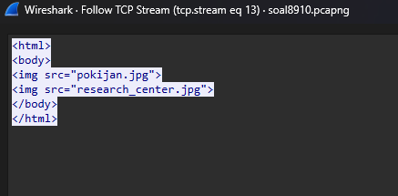

   
   

## Task 10

- Flag

  `JARKOM25{f1nisssshs55s5s533s_l1n333ee333E3_62220969332910h2rh1zg8bp345215123123RQ7RUTRKJG5K3FQ_5a17fc78722146cba5de712ff1fbd7ec}`

  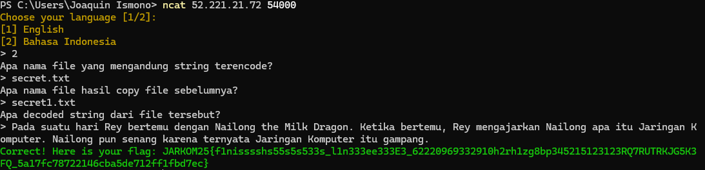

> a. Apa nama file yang mengandung string terencode?

> _a. What is the filename that contains encoded string?_

**Answer:** `secret.txt`

- Filter expression

  `ftp`

- Explanation

  `Gunakan "Follow Stream", lalu bisa melihat conversation yang terjadi antara client dan server pada stream 8. Disana, terlihat client melakukan "RETR secret.txt". Isi dari secret.txt pun bisa dilihat di stream 19.`

- Output result

  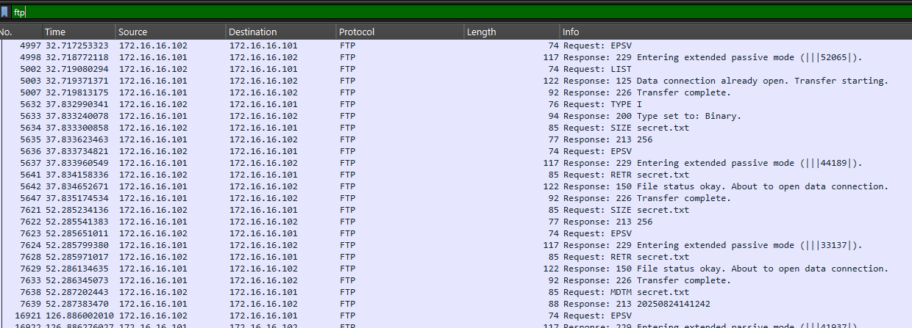

   
   

> b. Apa nama file hasil copy file sebelumnya?

> _b. What is the filename of the previous file copy?_

**Answer:** `secret1.txt`

- Filter expression

  `ftp`

- Explanation

  `Sama dengan 10-a, pada stream 8, client melakukan "STOR secret1.txt". Artinya, client meng-copy file ke dalam server menggunakan nama file "secret1.txt".`

- Output result

  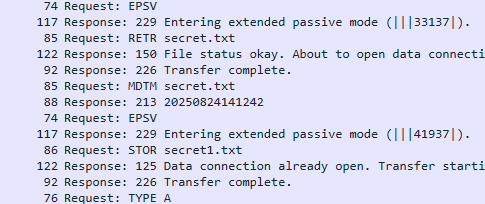

   
   

> c. What is the decoded string from the previous file?

> _c. Apa decoded string dari file tersebut?_

**Answer:** `Pada suatu hari Rey bertemu dengan Nailong the Milk Dragon. Ketika bertemu, Rey mengajarkan Nailong apa itu Jaringan Komputer. Nailong pun senang karena ternyata Jaringan Komputer itu gampang.`

- Filter expression

  `ftp`

- Explanation

  `Menggunakan informasi dari 10-a, kita bisa meng-copy isi dari secret.txt pada stream 19, lalu memasukkannya ke dalam Cipher Identifier. Ditemukan bahwa string di-encode ke dalam base64, jadi langsung gunakan tool decode base64.`

- Output result

  [Cipher Identifier](https://www.boxentriq.com/code-breaking/cipher-identifier)
  
  [Base64 Decoder Tool](https://www.boxentriq.com/code-breaking/base64-decoder)

  Isi dari secret.txt:
  
  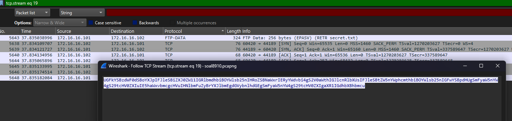

  Isi dari secret.txt setelah di-decode:
  
  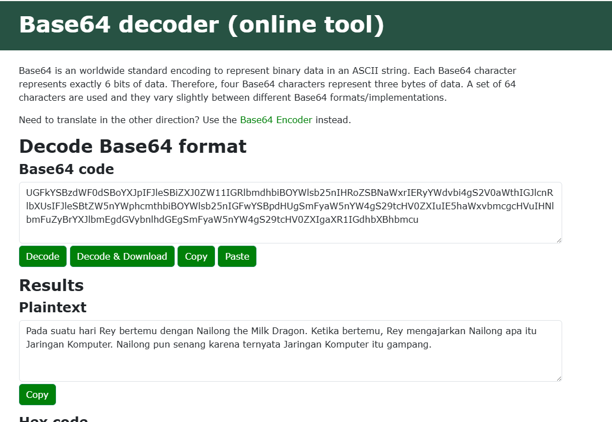

   
   

## Summary

Praktikum Modul 1 ini kurang lebih sama seperti Praktikum Modul 1 pada tahun-tahun sebelumnya, jadi saya bisa belajar dari repository-repository public dari github kakak tingkat. Ditambah saat asistensi, asisten juga dengan baik menjelaskan soal-soal yang mungkin akan keluar (kebetulan asisten pribadi saya yang buat soal hehe). Overall, walaupun ada beberapa task/soal yang sedikit membingungkan, saya berhasil mendapatkan 10 flags dari 10 flags yang tersedia. Mantap.

## Problems

Terdapat masalah pada task 2 tentang filtering. Disitu saya agak kebingungan saat melakukan filtering terhadap flags [ACK], apalagi pada task 2-c. Saya agak terkecoh pada filtering yang saya buat awalnya. Namun, masalah itu dapat diselesaikan tepat sebelum durasi praktikum berakhir. Selain itu, mungkin pencarian jawaban dari sebagian task ada yang "brute force", dengan menggunakan follow stream dan klik-klik sampai ketemu jawabannya.
