[](https://classroom.github.com/a/n46DTjYP)
| Name           | NRP        | Kelas     |
| ---            | ---        | ----------|
| Joaquin Fairuz Nawfal Ismono | 5025241106 | A |


## Put your topology config image here!

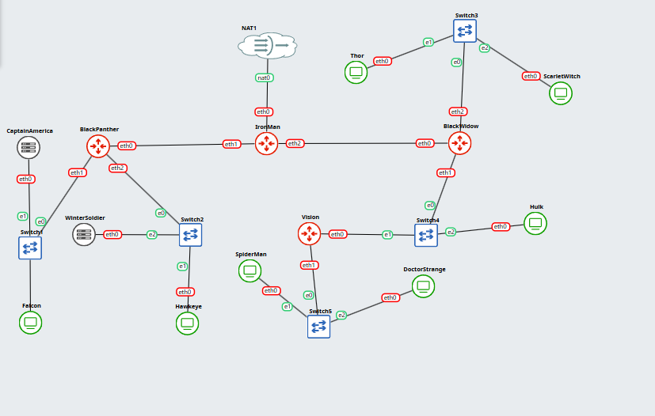


## Put your GNS3 Project file here!

[Link GDrive](https://drive.google.com/file/d/1-yJbDlBQypbfq19pxpR2zcgnoIE3Xikz/view?usp=sharing)

<br>

## Soal 1

> Dokumentasikan hasil pengelompokan subnet yang telah dibuat.

> _Document the results of the subnet grouping that has been created._

**Answer:**

| No. | Network Address | Prefix / Netmask    | Gateway   | Keterangan (Penggunaan)           |
| --- | --------------- | ------------------- | --------- | ------------------------------    |
| 1   | 10.28.1.0       | /24 (255.255.255.0) | 10.28.1.1 | Subnet IronMan & BlackPanther     |
| 2   | 10.28.2.0       | /24 (255.255.255.0) | 10.28.2.1 | Subnet BlackWidow                 |
| 3   | 10.28.3.0       | /24 (255.255.255.0) | 10.28.3.1 | Subnet CaptainAmerica, Falcon     |
| 4   | 10.28.4.0       | /24 (255.255.255.0) | 10.28.4.1 | Subnet Hawkeye, WinterSoldier     |
| 5   | 10.28.5.0       | /24 (255.255.255.0) | 10.28.5.1 | Subnet ScarletWitch, Thor         |
| 6   | 10.28.6.0       | /24 (255.255.255.0) | 10.28.6.1 | Subnet Vision, Hulk               |
| 7   | 10.28.7.0       | /24 (255.255.255.0) | 10.28.7.1 | Subnet SpiderMan, Doctor Strange  |


- Screenshot

  1. Konfigurasi IronMan:

  ```sh
  auto eth0
  iface eth0 inet dhcp
  
  auto eth1
  iface eth1 inet static
	address 10.28.1.1
	netmask 255.255.255.0
  
  auto eth2
  iface eth2 inet static
	address 10.28.2.1
	netmask 255.255.255.0
  
  up apt update
  up apt install iptables
  
  up iptables -t nat -A POSTROUTING -o eth0 -j MASQUERADE -s 10.28.0.0/16
  up ip route add 10.28.3.0/24 via 10.28.1.2
  up ip route add 10.28.4.0/24 via 10.28.1.2
  up ip route add 10.28.5.0/24 via 10.28.2.2
  up ip route add 10.28.6.0/24 via 10.28.2.2
  up ip route add 10.28.7.0/24 via 10.28.2.2
  up apt-get update
  up apt-get install isc-dhcp-relay -y
  up service isc-dhcp-relay start
  ```

  2. Konfigurasi BlackPanther:

  ```sh
  auto eth0
  iface eth0 inet static
	address 10.28.1.2
	netmask 255.255.255.0
	gateway 10.28.1.1
  
  auto eth1
  iface eth1 inet static
	address 10.28.3.1
	netmask 255.255.255.0
  
  auto eth2
  iface eth2 inet static
	address 10.28.4.1
	netmask 255.255.255.0
  
  up echo nameserver 192.168.122.1 > /etc/resolv.conf
  up apt-get update
  up apt-get install isc-dhcp-relay -y
  up service isc-dhcp-relay start
  ```

  3. Konfigurasi BlackWidow:

  ```sh
  auto eth0
  iface eth0 inet static
	address 10.28.2.2
	netmask 255.255.255.0
	gateway 10.28.2.1
  
  auto eth1
  iface eth1 inet static
	address 10.28.6.1
	netmask 255.255.255.0
  
  auto eth2
  iface eth2 inet static
	address 10.28.5.1
	netmask 255.255.255.0
  
  up echo nameserver 192.168.122.1 > /etc/resolv.conf
  up ip route add 10.28.7.0/24 via 10.28.6.2
  up apt-get update
  up apt-get install isc-dhcp-relay -y
  up service isc-dhcp-relay start
  ```

  4. Konfigurasi Vision:

  ```sh
  auto eth0
  iface eth0 inet static
	address 10.28.6.2
	netmask 255.255.255.0
	gateway 10.28.6.1
  
  auto eth1
  iface eth1 inet static
	address 10.28.7.1
	netmask 255.255.255.0
  
  up echo nameserver 192.168.122.1 > /etc/resolv.conf
  up apt-get update
  up apt-get install isc-dhcp-relay -y
  up service isc-dhcp-relay start
  ```

  5. Konfigurasi CaptainAmerica:

  ```sh
  auto eth0
  iface eth0 inet static
	address 10.28.3.2
	netmask 255.255.255.0
	gateway 10.28.3.1
  
  up echo nameserver 192.168.122.1 > /etc/resolv.conf
  up apt-get update
  up apt-get install isc-dhcp-server
  ```

  6. Konfigurasi WinterSoldier:

  ```sh
  auto eth0
  iface eth0 inet static
	address 10.28.4.2
	netmask 255.255.255.0
	gateway 10.28.4.1
  
  up echo nameserver 192.168.122.1 > /etc/resolv.conf
  up apt-get update
  up apt-get install isc-dhcp-server
  ```

  7. Konfigurasi Falcon:

  ```sh
  # Static config for eth0
  #auto eth0
  #iface eth0 inet static
  #	address 10.28.3.3
  #	netmask 255.255.255.0
  #	gateway 10.28.3.1
  #up echo nameserver 192.168.122.1 > /etc/resolv.conf
  
  # DHCP config for eth0
  auto eth0
  iface eth0 inet dhcp
  ```

  8. Konfigurasi Hawkeye:

  ```sh
  # Static config for eth0
  #auto eth0
  #iface eth0 inet static
  #	address 10.28.4.3
  #	netmask 255.255.255.0
  #	gateway 10.28.4.1
  #up echo nameserver 192.168.122.1 > /etc/resolv.conf
  
  # DHCP config for eth0
  auto eth0
  iface eth0 inet dhcp
  hwaddress ether 02:42:ca:0f:bd:00
  ```

  9. Konfigurasi Thor:

  ```sh
  # Static config for eth0
  #auto eth0
  #iface eth0 inet static
  #	address 10.28.5.2
  #	netmask 255.255.255.0
  #	gateway 10.28.5.1
  #up echo nameserver 192.168.122.1 > /etc/resolv.conf
  
  # DHCP config for eth0
  auto eth0
  iface eth0 inet dhcp
  hwaddress ether 02:42:29:84:8b:00
  ```

  10. Konfigurasi ScarletWitch:

  ```sh
  # Static config for eth0
  #auto eth0
  #iface eth0 inet static
  #	address 10.28.5.3
  #	netmask 255.255.255.0
  #	gateway 10.28.5.1
  #up echo nameserver 192.168.122.1 > /etc/resolv.conf
  
  # DHCP config for eth0
  auto eth0
  iface eth0 inet dhcp
  ```

  11. Konfigurasi Hulk:

  ```sh
  # Static config for eth0
  #auto eth0
  #iface eth0 inet static
  #	address 10.28.6.3
  #	netmask 255.255.255.0
  #	gateway 10.28.6.1
  #up echo nameserver 192.168.122.1 > /etc/resolv.conf
  
  # DHCP config for eth0
  auto eth0
  iface eth0 inet dhcp
  ```

  12. Konfigurasi Spiderman:

  ```sh
  # Static config for eth0
  #auto eth0
  #iface eth0 inet static
  #	address 10.28.7.2
  #	netmask 255.255.255.0
  #	gateway 10.28.7.1
  #up echo nameserver 192.168.122.1 > /etc/resolv.conf
  
  # DHCP config for eth0
  auto eth0
  iface eth0 inet dhcp
  hwaddress ether 02:42:32:7f:c3:00
  ```

  13. Konfigurasi DoctorStrange:

  ```sh
  # Static config for eth0
  #auto eth0
  #iface eth0 inet static
  #	address 10.28.7.3
  #	netmask 255.255.255.0
  #	gateway 10.28.7.1
  #up echo nameserver 192.168.122.1 > /etc/resolv.conf
  
  # DHCP config for eth0
  auto eth0
  iface eth0 inet dhcp
  ```

- Explanation

  `Mengikuti arahan soal, konfigurasi DHCP server dan relay statis, sedangkan client menggunakan IP dinamis dari DHCP server. Ada beberapa startup script yang ditambahkan agar tidak terlalu mengulang pekerjaan (kecuali konfigurasi DHCP server dan relay).`

<br>

## Soal 2

> Lakukan konfigurasi routing agar setiap node dapat saling berkomunikasi. Pastikan setiap router dapat mengirimkan paket ke jaringan lain melalui tabel routing yang sesuai. Sertakan bukti bahwa Falcon bisa melakukan ping ke SpiderMan, DoctorStrange, dan ScarletWitch.

> _Configure routing so that each node can communicate with each other. Ensure each router can forward packets to other networks through the appropriate routing table. Include proof that Falcon can ping SpiderMan, Doctor Strange, and ScarletWitch._

**Answer:**

- Screenshot

  `Routing BlackWidow`

  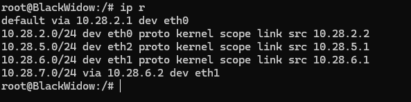

  `Routing IronMan`
  
  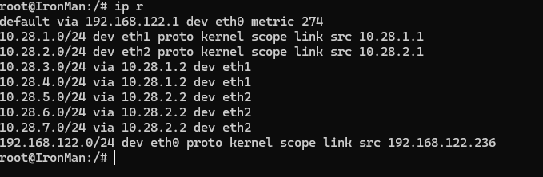

  `X.X.7.2 = SpiderMan; X.X.7.3 = DoctorStrange; X.X.5.3 = Scarlet Witch`

  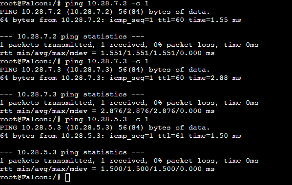

- Explanation

  `Menggunakan Static Routing untuk menghubungkan semua nodes.`

<br>

## Soal 3

> Lakukan konfigurasi agar semua node dapat terhubung ke internet. Sertakan hasil uji coba dengan melakukan ping ke google.com dari node Falcon, CaptainAmerica, SpiderMan, dan Thor.

> _Configure all nodes to connect to the internet. Include test results by pinging google.com from the Falcon, CaptainAmerica, SpiderMan, and Thor nodes._

**Answer:**

- Screenshot

  `ping google.com Falcon`
  
  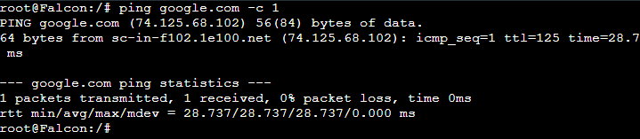

  `ping google.com CaptainAmerica`
  
  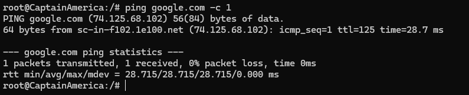

  `ping google.com SpiderMan`
  
  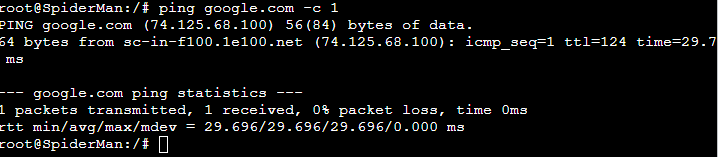

  `ping google.com Thor`
  
  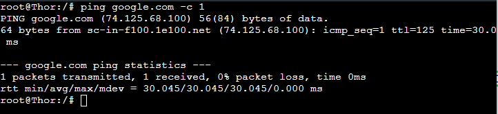


- Explanation

  `Mengikuti yang ada di Modul GNS3, pada IronMan ditambahkan startup script, lalu menambahkan command echo nameserver... di node yang lain.`

<br>

## Soal 4

> Berikan Falcon alamat IP dalam rentang [Prefix IP].3.20 - [Prefix IP].3.25
> <br> </br>
> Berikan Hawkeye alamat IP dalam rentang [Prefix IP].4.30 - [Prefix IP].4.35
> <br> </br>
> Berikan Hulk alamat IP dalam rentang [Prefix IP].6.50 - [Prefix IP].6.55

<br>

> _Give Falcon an IP address in the range [IP Prefix].3.20 - [IP Prefix].4.35_
> <br> </br>
> _Give Hawkeye an IP address in the range [IP Prefix].4.30 - [IP Prefix].4.35_
> <br> </br>
> _Give Hulk an IP address in the range [IP Prefix].6.50 - [IP Prefix].6.55_

**Answer:**

- Screenshot

  `Isi dari /etc/dhcp/dhcpd.conf pada node Captain America`
  ```sh
  failover peer "dhcp-failover" {
    primary;                        
    address 10.28.3.2;              
    peer address 10.28.4.2;        
    max-response-delay 60;
    max-unacked-updates 10;
    mclt 3600;
    split 128;                      
    load balance max seconds 3;
  }
  
  subnet 10.28.3.0 netmask 255.255.255.0 {
    pool {
      failover peer "dhcp-failover";
      range 10.28.3.20 10.28.3.25;
    }
  option routers 10.28.3.1;
  option broadcast-address 10.28.3.255;
  option domain-name-servers 192.168.122.1;
  default-lease-time 120;
  max-lease-time 6000;
  }
  
  subnet 10.28.4.0 netmask 255.255.255.0 {
    pool {
      failover peer "dhcp-failover";
      range 10.28.4.30 10.28.4.35;
    }
  option routers 10.28.4.1;
  option broadcast-address 10.28.4.255;
  option domain-name-servers 192.168.122.1;
  default-lease-time 300;
  max-lease-time 7200;
  }
  
  subnet 10.28.5.0 netmask 255.255.255.0 {
    pool {
      failover peer "dhcp-failover";
      range 10.28.5.40 10.28.5.45;
    }
  option routers 10.28.5.1;
  option broadcast-address 10.28.5.255;
  option domain-name-servers 192.168.122.1;
  default-lease-time 120;
  max-lease-time 6000;
  }
  
  subnet 10.28.6.0 netmask 255.255.255.0 {
    pool {
      failover peer "dhcp-failover";
      range 10.28.6.50 10.28.6.55;
    }
  option routers 10.28.6.1;
  option broadcast-address 10.28.6.255;
  option domain-name-servers 192.168.122.1;
  default-lease-time 600;
  max-lease-time 7200;
  }
  
  subnet 10.28.7.0 netmask 255.255.255.0 {
    pool {
      failover peer "dhcp-failover";
      range 10.28.7.60 10.28.7.65;
    }
  option routers 10.28.7.1;
  option broadcast-address 10.28.7.255;
  option domain-name-servers 192.168.122.1;
  default-lease-time 300;
  max-lease-time 7200;
  }
  ```

  `IP Falcon`
  
  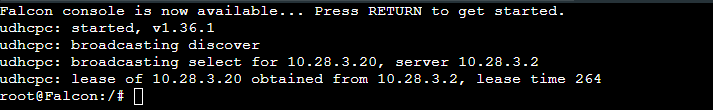

  `IP Hawkeye`
  
  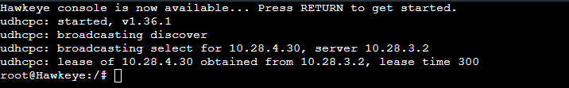

  `IP Hulk`

  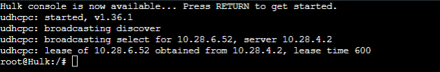


- Explanation

  `Menggunakan conf DHCP server dari CaptainAmerica.`

<br>

## Soal 5

> Berikan ScarletWitch dan Thor alamat IP dalam rentang [Prefix IP].5.40 - [Prefix IP].5.45 dan [Prefix IP].5.100 - [Prefix IP].5.105

> _Give ScarletWitch and Thor IP addresses in the range [IP Prefix].5.40 - [IP Prefix].5.45 and [IP Prefix].5.100 - [IP Prefix].5.105_

**Answer:**

- Screenshot

  `IP ScarletWitch`

  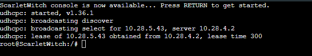

  `IP Thor`

  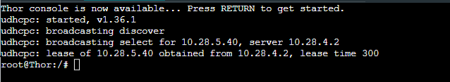


- Explanation

  `Kurang lebih sama dengan nomor 4, hanya menambahkan routing ke switch3`

<br>

## Soal 6

> Berikan SpiderMan dan DoctorStrange alamat IP dalam rentang [Prefix IP].7.60 - [Prefix IP].7.65  dan [Prefix IP].7.110 - [Prefix IP].7.115

> _Give SpiderMan and DoctorStrange IP addresses in the ranges [IP Prefix].7.60 - [IP Prefix].7.65 and [IP Prefix].7.110 - [IP Prefix].7.115_

**Answer:**

- Screenshot

  `IP SpiderMan`

  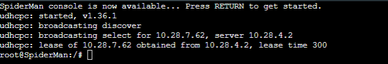


  `IP DoctorStrange`

  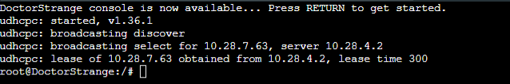


- Explanation

  `Gabungan soal 4 & 5, menambahkan routing ke switch 4 & 5`

<br>

## Soal 7

> Tetapkan waktu peminjaman alamat IP pada DHCP server untuk client yang terhubung melalui Switch 2 selama 5 menit (Default), dan untuk client melalui Switch 5 selama 10 menit (Default). Tetapkan juga batas waktu peminjaman maksimal selama 2 jam.
> <br> </br>
> Tetapkan waktu peminjaman alamat IP pada DHCP server untuk client yang terhubung melalui Switch 1 dan Switch 3 selama 2 menit (Default). Tetapkan juga batas waktu peminjaman maksimal selama 100 menit.

<br>

> _Set the IP address lease period on the DHCP server for clients connected through Switch 2 to 5 minutes (default), and for clients connected through Switch 5 to 10 minutes (default). Also, set the maximum lease period to 2 hours._
> <br> </br>
> _Set the IP address lease time on the DHCP server for clients connected via Switch 1 and Switch 3 to 2 minutes (default). Also set the maximum lease time limit to 100 minutes._

**Answer:**

- Screenshot

  `Isi dari file /etc/dhcp/dhcpd.conf`

  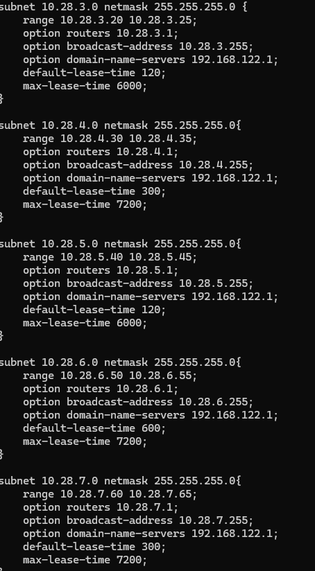


- Explanation

  `Mengganti konfigurasi do /etc/dhcp/dhcpd.conf pada node Captain America (dan nantinya WinterSoldier) agar sesuai dengan lease time yang ditentukan soal`

<br>

## Soal 8

> Ubah konfigurasi DHCP Server agar Hawkeye, Thor, dan SpiderMan mendapatkan IP statis dengan [Prefix IP].x.5, namun masih menggunakan DHCP.

> _Change the DHCP Server configuration so that Hawkeye, Thor, and SpiderMan get static IPs with [Prefix IP].x.5, but still use DHCP._

**Answer:**

- Screenshot

  `Untuk ditambahkan ke dalam /etc/dhcp/dhcpd.conf`

  ```sh
    host Hawkeye {
  hardware ethernet 02:42:ca:0f:bd:00;
  fixed-address 10.28.4.5;
  }
  
  host Thor {
  hardware ethernet 02:42:29:84:8b:00;
  fixed-address 10.28.5.5;
  }
  
  host SpiderMan {
  hardware ethernet 02:42:32:7f:c3:00;
  fixed-address 10.28.7.5;
  }
  ```

  `IP Hawkeye`

  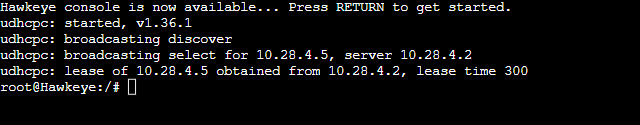

  `IP Thor`

  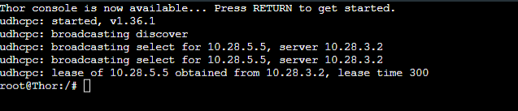

  `IP SpiderMan`

  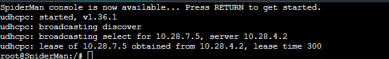


- Explanation

  `Mengganti konfigurasi do /etc/dhcp/dhcpd.conf pada node Captain America (dan nantinya WinterSoldier) agar node Hawkeye, Thor, dan Spiderman mendapatkan fixed-address`

<br>

## Soal 9

> Buatlah konfigurasi DHCP Failover dengan WinterSoldier sebagai DHCP server backup untuk CaptainAmerica.

> _Create a DHCP Failover configuration with WinterSoldier as the backup DHCP server for CaptainAmerica._

**Answer:**

- Screenshot

  `Isi dari /etc/dhcp/dhcpd.conf pada WinterSoldier`

    ```sh
  failover peer "dhcp-failover" {
    secondary;                        
    address 10.28.4.2;              
    peer address 10.28.3.2;        
    max-response-delay 60;
    max-unacked-updates 10;
    mclt 3600;                      
    load balance max seconds 3;
  }
  
  subnet 10.28.3.0 netmask 255.255.255.0 {
    pool {
      failover peer "dhcp-failover";
      range 10.28.3.20 10.28.3.25;
    }
  option routers 10.28.3.1;
  option broadcast-address 10.28.3.255;
  option domain-name-servers 192.168.122.1;
  default-lease-time 120;
  max-lease-time 6000;
  }
  
  subnet 10.28.4.0 netmask 255.255.255.0 {
    pool {
      failover peer "dhcp-failover";
      range 10.28.4.30 10.28.4.35;
    }
  option routers 10.28.4.1;
  option broadcast-address 10.28.4.255;
  option domain-name-servers 192.168.122.1;
  default-lease-time 300;
  max-lease-time 7200;
  }
  
  subnet 10.28.5.0 netmask 255.255.255.0 {
    pool {
      failover peer "dhcp-failover";
      range 10.28.5.40 10.28.5.45;
    }
  option routers 10.28.5.1;
  option broadcast-address 10.28.5.255;
  option domain-name-servers 192.168.122.1;
  default-lease-time 120;
  max-lease-time 6000;
  }
  
  subnet 10.28.6.0 netmask 255.255.255.0 {
    pool {
      failover peer "dhcp-failover";
      range 10.28.6.50 10.28.6.55;
    }
  option routers 10.28.6.1;
  option broadcast-address 10.28.6.255;
  option domain-name-servers 192.168.122.1;
  default-lease-time 600;
  max-lease-time 7200;
  }
  
  subnet 10.28.7.0 netmask 255.255.255.0 {
    pool {
      failover peer "dhcp-failover";
      range 10.28.7.60 10.28.7.65;
    }
  option routers 10.28.7.1;
  option broadcast-address 10.28.7.255;
  option domain-name-servers 192.168.122.1;
  default-lease-time 300;
  max-lease-time 7200;
  }
  
  host Hawkeye {
  hardware ethernet 02:42:ca:0f:bd:00;
  fixed-address 10.28.4.5;
  }
  
  host Thor {
  hardware ethernet 02:42:29:84:8b:00;
  fixed-address 10.28.5.5;
  }
  
  host SpiderMan {
  hardware ethernet 02:42:32:7f:c3:00;
  fixed-address 10.28.7.5;
  }
  ```

  `Contoh Kasus jika kita stop DHCP Server CaptainAmerica (IP: 10.28.3.2), maka node Falcon akan tetap dapat me-'lease' IP dari DHCP Server Winter Soldier (IP: 10.28.4.2)`

  DHCP Server CaptainAmerica di-stop

  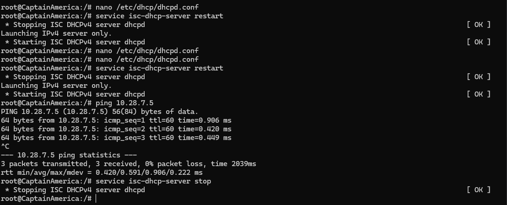

  Client Falcon dapat IP dari WinterSoldier

  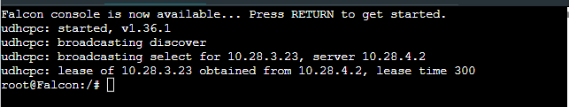

- Explanation

  `Mengikuti arahan yang tercantum dalam soal, kita pakai DHCP failover peer dan tambahkan konfigurasi pada WinterSoldier sebagai secondary DHCP server`

<br>

## Soal 10

> Buatlah konfigurasi agar CaptainAmerica dan WinterSoldier berjalan dengan mode Load Balancing.

> _Create a configuration so that CaptainAmerica and WinterSoldier run in Load Balancing mode._

**Answer:**

- Screenshot

  `Modifikasi pada CaptainAmerica`

  ```sh
    failover peer "dhcp-failover" {
    primary;                        
    address 10.28.3.2;              
    peer address 10.28.4.2;        
    max-response-delay 60;
    max-unacked-updates 10;
    mclt 3600;
    split 128;                      
    load balance max seconds 3;
  }
  ```

  `Thor mendapat IP dari Server CaptainAmerica`

  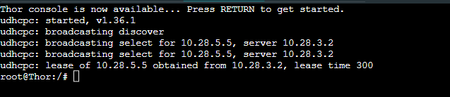

  `ScarletWitch mendapat IP dari Server WinterSoldier`

  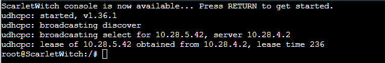


- Explanation

  `Hanya perlu modifikasi konfigurasi pada server Captain America sebagai primary server`

<br>
  
## Problems
GNS3 yang sering error, jadi menghambat pengerjaan yang menyebabkan praktikum tidak selesai tepat waktu. IP routing DHCP dari BlackWidow yang menyebabkan nodes yang berhubungan tidak ter-'lease'.

## Revisions (if any)
`4. Tambah IP Hulk`

`5. Tambah IP ScarletWitch, Tambah IP Thor`

`8. Tambah IP Hawkeye, Thor, SpiderMan`

`9. Tambah contoh kasus stop DHCP Server CaptainAmerica`

`10. Tambah contoh kasus pembagian tugas DHCP Server`

`- Lalu untuk config DHCP Relay BlackWidow & Vision sudah teratasi (Client Thor, ScarletWitch, Hulk, SpiderMan, DoctorStrange semua mendapatkan IP yang sesuai dengan ketentuan soal)`
