
| Name           | NRP        | Kelas     |
| ---            | ---        | ----------|
| Joaquin Fairuz Nawfal Ismono | 5025241106 | A |

## Put your topology config image here!

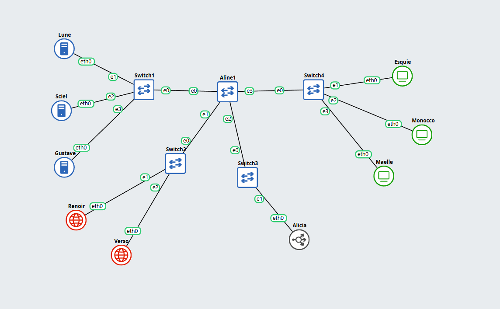

## Put your GNS3 Project file here!

[Gns3Project](tes%20Prak%20Modul%203.gns3project)

 

## Soal 1

> Setup Topo

> _Document the results of the subnet grouping that has been created._

**Answer:**

- Screenshot

1. Konfigurasi Subnet 10.28.2.X

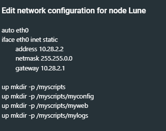

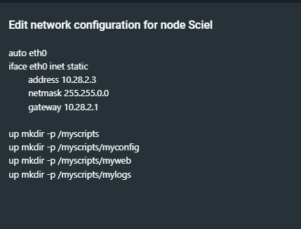

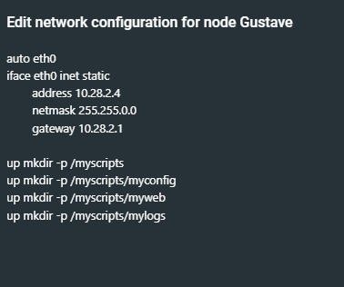

2. Konfigurasi Subnet 10.28.3.X

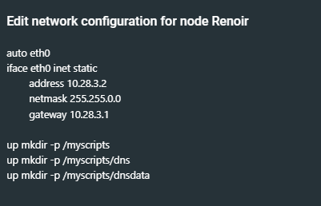

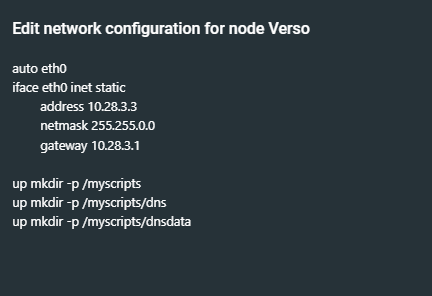

3. Konfigurasi Subnet 10.28.4.X

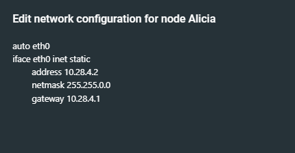

4. Konfigurasi Subnet 10.28.5.X

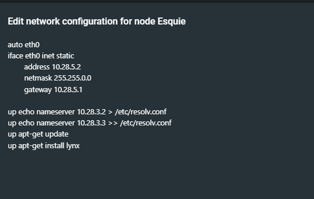

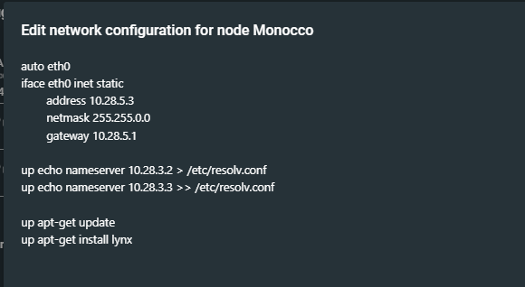

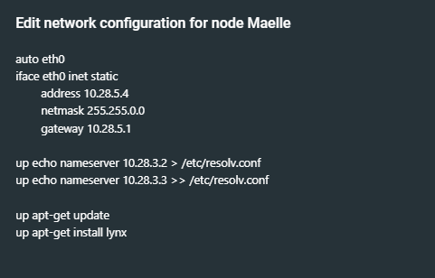

- Explanation

  `Put your explanation in here`

 

## Soal 2

> Buatlah konfigurasi untuk domain 
> **lune33.com** → ke IP node Lune , 
> **sciel33.com** → ke IP node Sciel ,
> **gustave33.com** → ke IP node Gustave 
> pada DNS Master Renoir. Kemudian konfigurasikan node Verso sebagai DNS Slave yang bekerja untuk DNS Master Renoir.

> _Dns Configuration , on  the DNS Master (Renoir)_
> _lune33.com → IP of node Lune ,_
> _sciel33.com → IP of node Sciel ,_
> _gustave33.com → IP of node Gustave_
> _Configure Verso as the DNS Slave that works with DNS Master Renoir._

**Answer:**

- Screenshot

1. Isi dari /myscripts/dns/named.conf dari Renoir

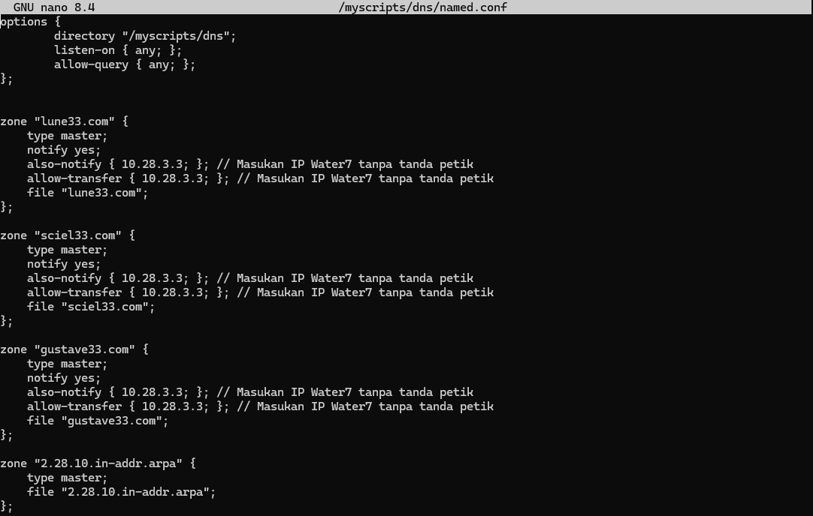

2. Isi dari /myscripts/dns/lune33.com dari Renoir

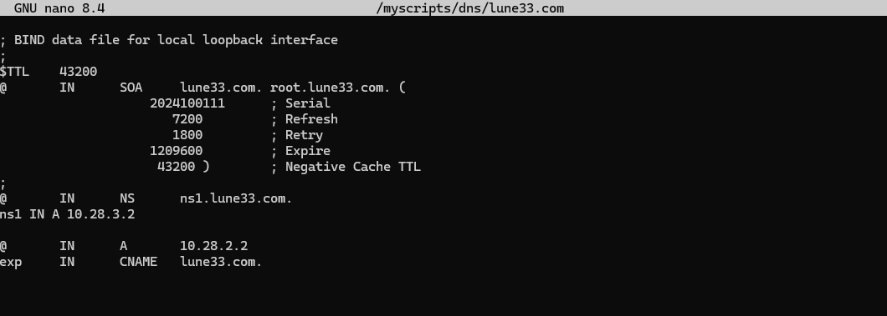

3. Isi dari /myscripts/dns/sciel33.com dari Renoir

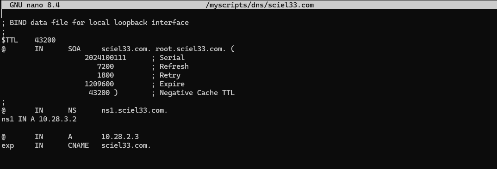

4. Isi dari /myscripts/dns/gustave33.com dari Renoir

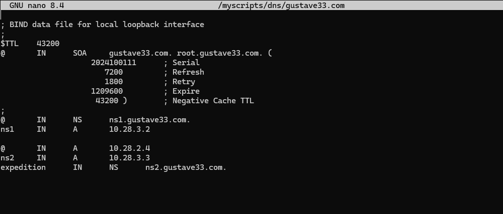

5. Isi dari /myscripts/dns/named.conf dari Verso

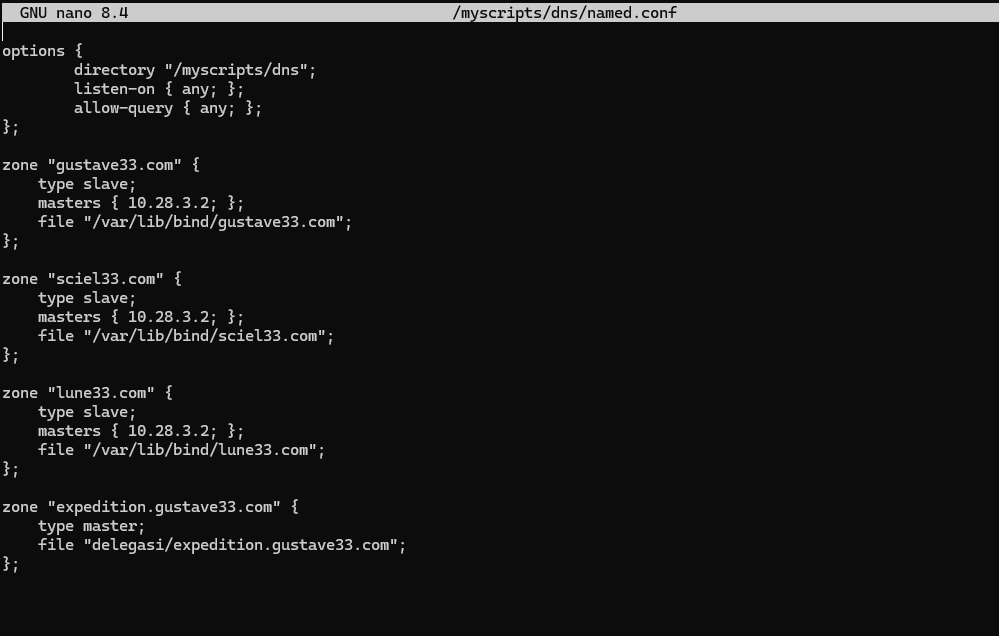

- Explanation

  `Put your explanation in here`

 

## Soal 3

> Tambahkan subdomain alias berupa exp.lune33.com yang mengarah ke alamat lune33.com dan exp.sciel33.com yang mengarah ke alamat sciel33.com (HINT: CNAME). Selain itu, tambahkan konfigurasi untuk melakukan reverse DNS lookup untuk domain gustave33.com

> _Subdomain Configuration,_ 
> _Add alias subdomains (HINT: CNAME)._
> _exp.lune33.com → alias to lune33.com_
> _exp.sciel33.com → alias to sciel33.com_
> _Also, configure reverse DNS lookup for the domain gustave33.com._

**Answer:**

- Screenshot

1. Isi dari /myscripts/dns/lune33.com dari Renoir

2. Isi dari /myscripts/dns/sciel33.com dari Renoir

3. Isi dari /myscripts/dns/gustave33.com dari Renoir

4. Isi dari /myscripts/dns/named.conf dari Renoir

5. Isi dari /myscripts/dns/2.168.192.in-addr.arpa dari Renoir

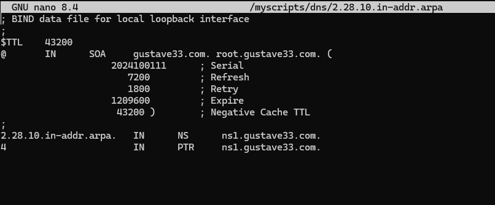

- Explanation

  `Tambahkan exp     IN      CNAME   [[namaDomain]].com. pada file Lune dan Sciel, lalu tambahkan reverse PTR untuk Gustave`

 

## Soal 4

> Buatlah subdomain berupa expedition.gustave33.com dan delegasikan subdomain tersebut dari Renoir ke Verso dengan alamat IP tujuan adalah node Gustave. Kemudian, matikan Renoir dan coba lakukan ping ke semua domain dan subdomain yang telah dikonfigurasikan pada nomor 2, 3, dan 4.

> _Create a subdomain expedition.gustave33.com and delegate it from Renoir to Verso, with the target IP being node Gustave.Then, turn off Renoir and try pinging all domains and subdomains configured in tasks 2, 3, and 4 to verify delegation works correctly._

**Answer:**

- Screenshot

1. Isi dari /myscripts/dns/gustave33.com dari Renoir

2. Isi dari /myscripts/dns/delegasi/expedition.gustave33.com dari Verso

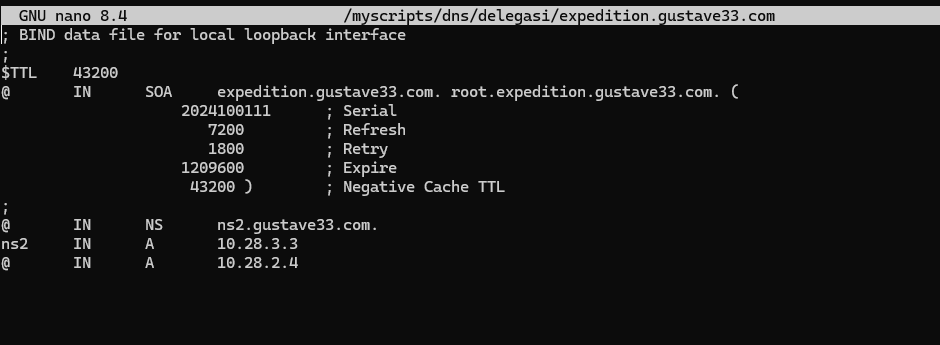

3. Isi dari /myscripts/dns/named.conf dari Verso

4. Hasil ping domain lune33.com dari Client Esquie

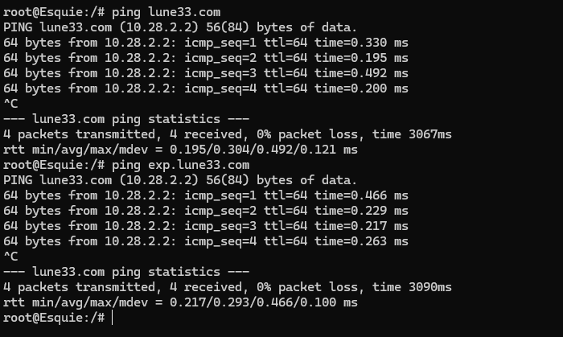

5. Hasil ping domain sciel33.com dari Client Esquie

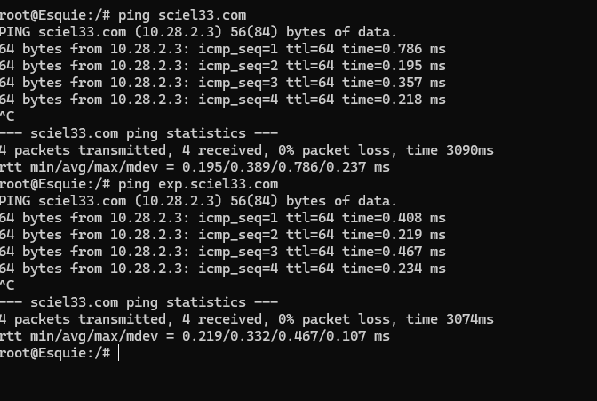

4. Hasil ping domain gustave33.com dari Client Esquie

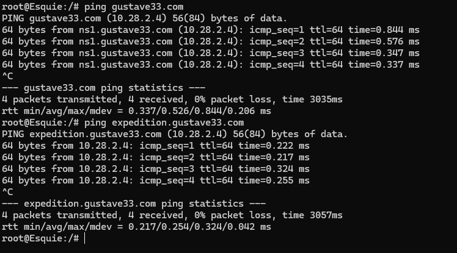

- Explanation

  `Put your explanation in here`

 

## Soal 5

> Konfigurasi node Lune, Sciel, dan Gustave agar berfungsi sebagai web server Nginx yang akan menyajikan halaman profil, dimana halaman profil akan berbeda untuk setiap node. Dari folder berikut, gunakan profile_lune.html untuk menyajikan halaman profil di node Lune, profile_sciel.html untuk menyajikan halaman profil di node Sciel, dan profile_gustave.html untuk menyajikan halaman profil di node Gustave. Konfigurasikan Nginx di setiap node untuk menyimpan custom access log ke file /tmp/access.log dan error log ke file /tmp/error.log. 

> _Configure Lune, Sciel, and Gustave as Nginx web servers serving profile pages, where each node has a unique profile page:_
> _- Use profile_lune.html for Lune_
> _- Use profile_sciel.html for Sciel_
> _- Use profile_gustave.html for Gustave_
> _In each web server, Configure Nginx to store custom logs:_
> _- Access log: /tmp/access.log_
> _- Error log: /tmp/error.log_

**Answer:**

- Screenshot

1. Isi dari /myscripts/myconfig/nginx.conf dari Semua Node Web Server

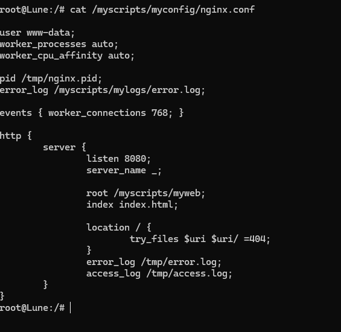

2. Hasil jika melakukan curl -vL 10.28.2.2:8080 di Client Esquie

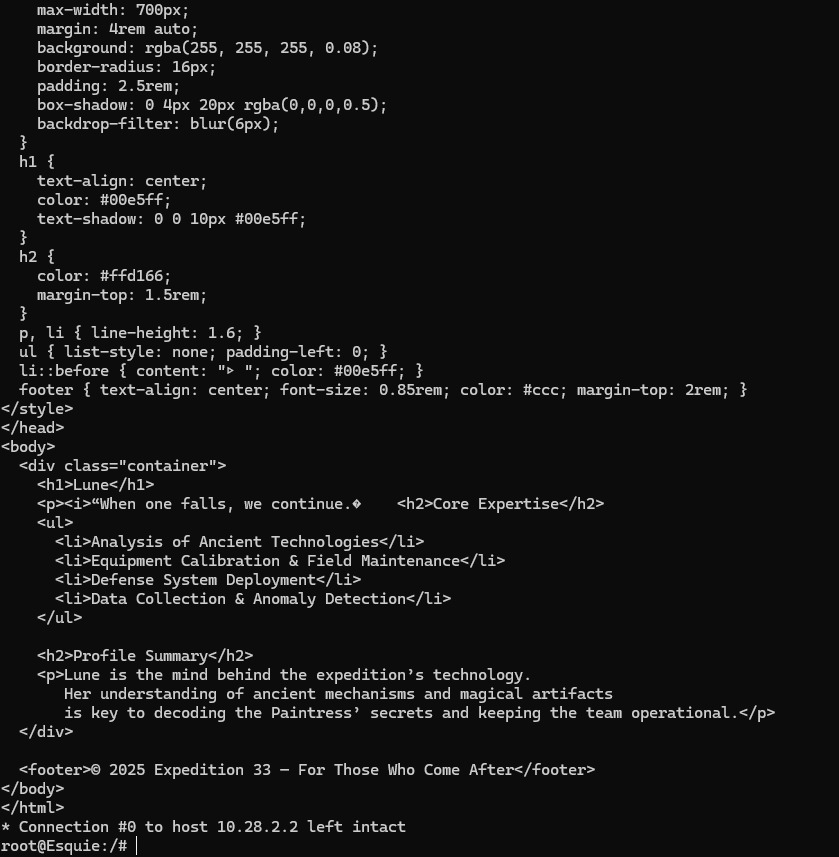

3. Hasil jika melakukan curl -vL 10.28.2.3:8080 di Client Esquie

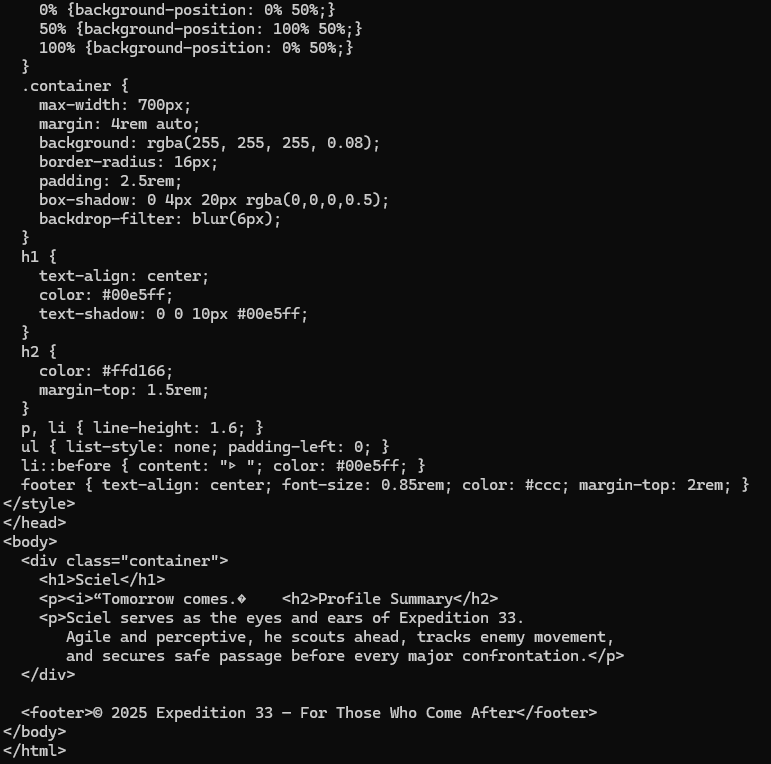

4. Hasil jika melakukan curl -vL 10.28.2.4:8080 di Client Esquie

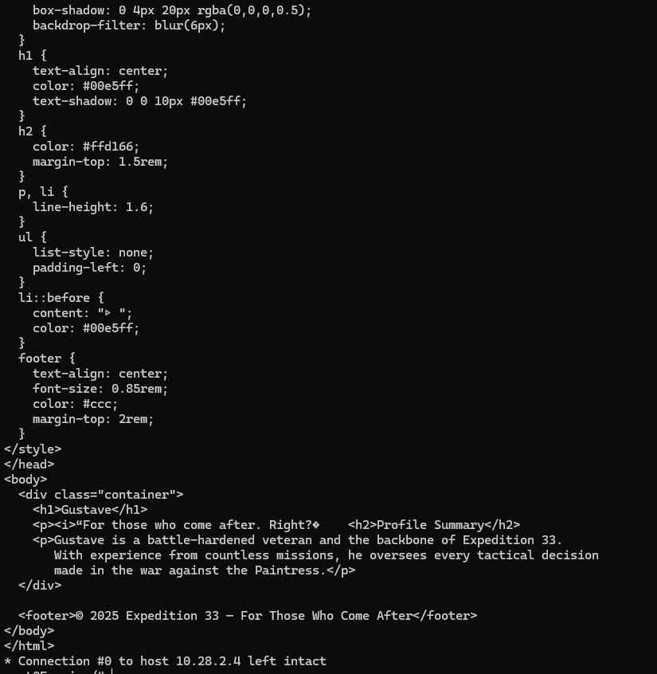

- Explanation

  `Put your explanation in here`

 

## Soal 6

> Setelah website berhasil dideploy pada masing-masing node web server dan halaman dapat menampilkan profil yang sesuai,  buatlah custom access log ke file /tmp/access.log di masing-masing node web server menggunakan format log tertentu seperti di bawah:
> - Tanggal dan waktu akses dalam format standar log.
> - Nama node yang sedang diakses.
> - Alamat IP klien yang mengakses website.
> - Metode HTTP dan URI yang diakses oleh klien.
> - Status respons HTTP yang diberikan oleh server.
> - Jumlah byte yang dikirimkan dalam respons.
> - Waktu yang dihabiskan oleh server untuk menangani permintaan.
> - Contoh format log yang sesuai:
>   [01/Oct/2024:11:30:45 +0000] Jarkom Node Lune Access from 192.168.1.15 using method "GET /resep/bayam HTTP/1.1" returned status 200 with 2567 bytes sent in 0.038 seconds

> _After successfully deploying each website and verifying the correct profile page is displayed, create a custom access log in /tmp/access.log on each web server using the following format:_
> _- Date and time of access (standard log format)_
> _- Name of the node being accessed_
> _- IP address of the client accessing the website_
> _- HTTP method and URI accessed by the client_
> _- HTTP response status code_
> _- Number of bytes sent in the response_
> _- Time taken by the server to process the request_
> _- Example Log Format:_
> _[01/Oct/2024:11:30:45 +0000] Jarkom Node Lune Access from 192.168.1.15 using method "GET /resep/bayam HTTP/1.1" returned status 200 with 2567 bytes sent in 0.038 seconds_

**Answer:**

- Screenshot

1. Isi dari /myscripts/myconfig/nginx.conf dari Semua Node Web Server

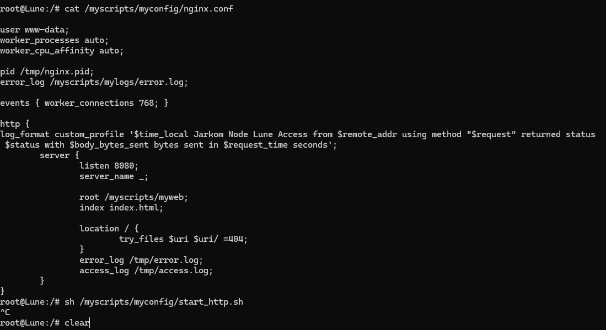

- Explanation

  `Tambahkan log_format custom_profile '$time_local Jarkom Node Lune Access from $remote_addr using method "$request" returned status $status with $body_bytes_sent bytes sent in $request_time seconds'; pada nginx.conf`

 

## Soal 7

> Gustave merupakan web server yang tidak disarankan untuk dilihat oleh publik. Maka dari itu, ubahlah konfigurasi nginx sehingga halaman profil Gustave menjadi hanya bisa di akses melalui port 8080 dan 8888.

> _The Gustave web server should not be publicly accessible.
Modify the Nginx configuration so that Gustave’s profile page can only be accessed through ports 8080 and 8888._

**Answer:**

- Screenshot

  `Put your screenshot in here`

- Explanation

  `Put your explanation in here`

 

## Soal 8

> Untuk mempermudah program ekspedisi, maka node Lune, Sciel, Gustave sepakat untuk membuat halaman informasi dengan konten yang sama. Maka dari itu, buatlah lagi 1 server block di dalam konfigurasi nginx yang akan menyajikan file HTML ini. Namun, mereka ingin menyajikan halaman informasi tersebut di port yang berbeda-beda, yaitu Lune menggunakan port 8000, Sciel menggunakan port 8100, dan Gustave menggunakan port 8200.

> _To simplify coordination for the expedition program, Lune, Sciel, and Gustave agree to create a shared information page with the same content. Add one more server block in each node’s Nginx configuration that serves this HTML file 
Each node should serve the information page on a different port:_
> _- Lune → port 8000_
> _- Sciel → port 8100_
> _- Gustave → port 8200_

**Answer:**

- Screenshot

  `Put your screenshot in here`

- Explanation

  `Put your explanation in here`

 

## Soal 9

> Untuk mempermudah akses ke profil tiap anggota ekspedisi, buatlah 1 domain lagi yaitu "expeditioners.com" yang akan mengarah ke Alicia. Lalu, untuk mencegah overload dari salah satu web server, konfigurasikan reverse proxy Alicia agar bisa forward request ke server yang sesuai berdasarkan URL profile yang diminta oleh klien dengan ketentuan sebagai berikut:
> -  Request untuk “expeditioners.com/profil_lune” harus dialihkan ke halaman profil web server Lune.
> -  Request untuk “expeditioners.com/profil_sciel” harus dialihkan ke halaman profil web server Sciel.
> -  Request untuk “expeditioners.com/profil_gustave” harus dialihkan ke halaman profil web server Gustave.
> Jika terdapat request ke URL selain profil yang ditentukan, reverse proxy akan mengalihkan ke halaman informasi pada web server Lune.

> _To make it easier to access each member’s profile, create a new domain “expeditioners.com” that points to Alicia. "
Configure Alicia’s reverse proxy (Nginx) to forward requests to the correct web server based on the requested URL, with the following rules:_
> _- Request URL expeditioners.com/profil_lune, Forward To Lune’s profile page_
> _- Request URL expeditioners.com/profil_sciel, Forward To Sciel’s profile page_
> _- Request URL expeditioners.com/profil_gustave, Forward To Gustave’s profile page_
> _- Any other URL, Forward To Lune’s information page_

**Answer:**

- Screenshot

  `Put your screenshot in here`

- Explanation

  `Put your explanation in here`

 

## Soal 10

> Untuk mendistribusikan traffic halaman informasi, atur Reverse Proxy Alicia agar dapat membagi pekerjaan kepada web server Lune, Sciel, dan Gustave secara optimal menggunakan algoritma Round-robin. Pastikan target pembagian load merupakan halaman informasi, bukan halaman profil masing-masing web server.

> _To distribute traffic for the information page, configure the reverse proxy (Alicia) to use Round-robin load balancing between the three web servers: Lune, Sciel, and Gustave.
Ensure that only the information page is included in the load-balancing configuration - not the profile pages._

**Answer:**

- Screenshot

  `Put your screenshot in here`

- Explanation

  `Put your explanation in here`

 
  
## Problems

## Revisions (if any)
Menyelesaikan soal nomor 4, 5, dan 6
