
| Name           | NRP        | Kelas     |
| ---            | ---        | ----------|
| Joaquin Fairuz Nawfal Ismono | 5025241106 | A |

## Put your topology config image here!

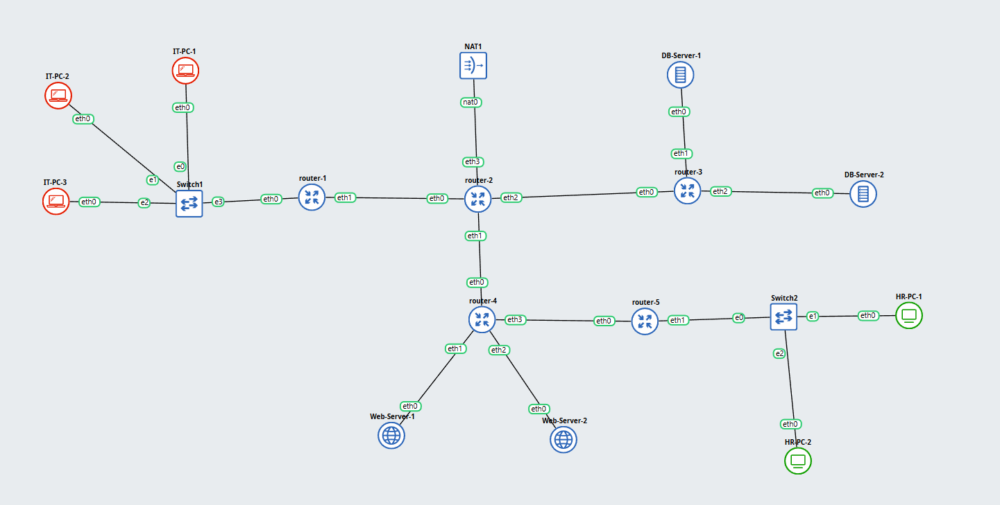

## Put your GNS3 Project file here!

[Gns3Project](RevPrak%204.gns3project)

 

## Soal 1

> Lakukan subnetting pada topologi diatas menggunakan metode VLSM: [Referensi](https://github.com/arsitektur-jaringan-komputer/Modul-Jarkom/tree/master/Modul-4/Subnetting#2-vlsm-variable-length-subnet-masking)  
*Cantumkan juga tabel dan diagram pembagian subnet pada laporan praktikum*.

> _Subnet the topology above using the VLSM method: [Reference](https://github.com/arsitektur-jaringan-komputer/Modul-Jarkom/tree/master/Modul-4/Subnetting#2-vlsm-variable-length-subnet-masking)_  
_Also include the subnet table and diagram in the lab report._

**Answer:**

- Screenshot

  `Put your screenshot in here`

- Explanation

  `Penjelasan dan tabel pembagian ada di` [sini](https://docs.google.com/spreadsheets/d/1S8fu-DV9AftY2vv7zk6mXLrc-PpXKPzx_RxLTMfJhjc/edit?usp=sharing) `dan saya juga meminta bantuan` [Google](https://subnettingpractice.com/vlsm.html) `untuk membagi subnet ke semua node.`

 

## Soal 2

> Buatlah agar router-2 dapat melakukan koneksi ke internet. [Dapat menggunakan static routing].

> _Make sure router-2 can connect to the internet. [Can use static routing]._

**Answer:**

- Screenshot

1. Hasil `ping google.com` dari node router-2

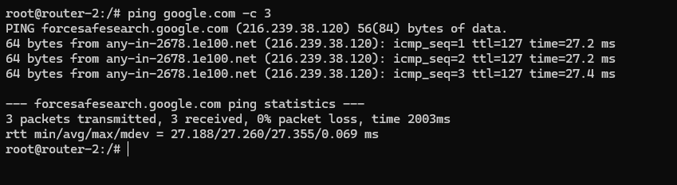

- Explanation

  `Hanya perlu menjadikan eth3 jadi dhcp dan sambungkan ke NAT.`

 

## Soal 3

> Setelah mengimplementasi subnetting, buatlah agar seluruh topologi dapat terhubung. Lakukan Dynamic Routing pada topologi tersebut.
*Pastikan seluruh node yang ada dapat mengakses internet*.

> _After implementing subnetting, ensure the entire topology is connected. Perform dynamic routing on the topology._  
_Ensure all existing nodes can access the internet._

**Answer:**

- Screenshot

1. Hasil jika melakukan `ping google.com` dan `ping [IP HR-PC-1]` di IT-PC-1

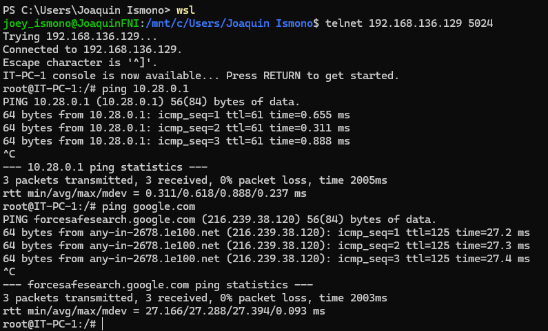

- Explanation

  `Semua langkah-langkah kurang lebih sudah ada di dokumen catatan ` [tertera](RevModul4.pdf)

 

## Soal 4

> Lakukan setup web server dengan file html di attachment berikut: [ Attachment ](https://drive.google.com/file/d/199qwfTNJCkxDV7mdO-MsaDdApkmKsnAG/view?usp=sharing)  menggunakan nginx pada “Web-Server-1” dan “Web-Server-2”.  
*Config dibebaskan kepada praktikkan dengan catatan menggunakan port 80*.

> _Set up a web server with the HTML file in the following attachment: [ Attachment ](https://drive.google.com/file/d/199qwfTNJCkxDV7mdO-MsaDdApkmKsnAG/view?usp=sharing) using nginx on “Web-Server-1” and “Web-Server-2”._
_Configuration is free to practice, but note that it uses port 80._

**Answer:**

- Screenshot

1. Hasil jika melakukan curl -vL 10.28.2.128:8080 di IT-PC-1

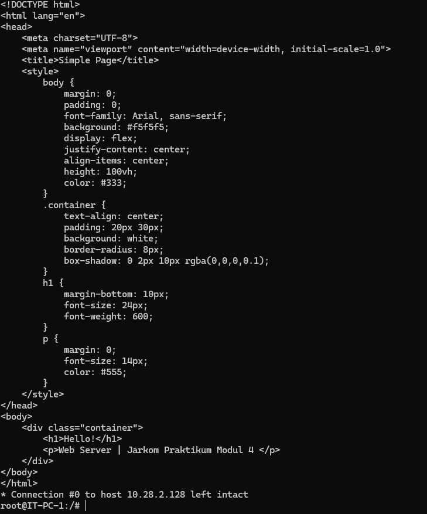

2. Hasil jika melakukan curl -vL 10.28.2.162:8080 di IT-PC-1

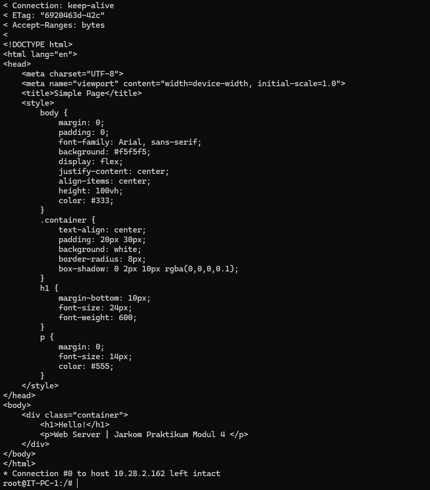

- Explanation

  `Hanya perlu mengikuti tutorial` [Case 4](https://docs.google.com/presentation/d/1-0o4vZsn0kwLg4ddg9zFebERS4x0V2IBeGmAEnzje2w/edit?slide=id.p#slide=id.p) `lalu mengganti port menjadi 80`

 

## Soal 5

> Kalian diminta untuk melakukan drop semua paket TCP yang masuk  ke subnet HR dengan port 1337 dan 4444. Lakukan testing dengan netcat.

> _You are asked to drop all incoming TCP packets to the HR subnet with ports 1337 and 4444. Test with netcat._

**Answer:**

- Screenshot

1. Yang dilakukan pada router-5

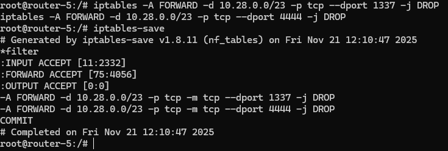

2. Hasil jika melakukan netcat dengan IT-PC-1 sebagai sender dan HR-PC-1 sebagai receiver

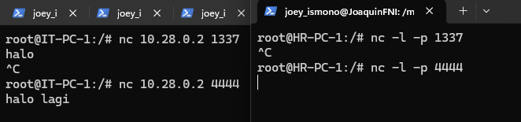

- Explanation

  `Semua langkah-langkah kurang lebih sudah ada di dokumen catatan ` [tertera](RevModul4.pdf)

 

## Soal 6

> Lakukan pembatasan sehingga koneksi SSH pada semua Web Server hanya dapat dilakukan oleh user yang berada pada node IT-PC-1, IT-PC-2, dan IT-PC-3. 

> _Implement restrictions so that SSH connections to all Web Servers can only be made by users on nodes IT-PC-1, IT-PC-2, and IT-PC-3._

**Answer:**

- Screenshot

1. Yang dilakukan pada Web-Server-1

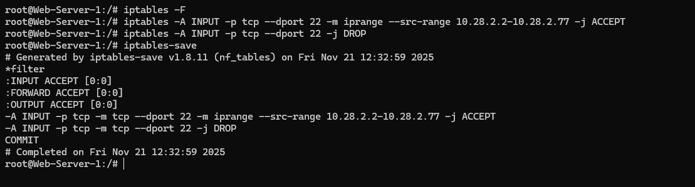

2. Yang dilakukan pada Web-Server-2

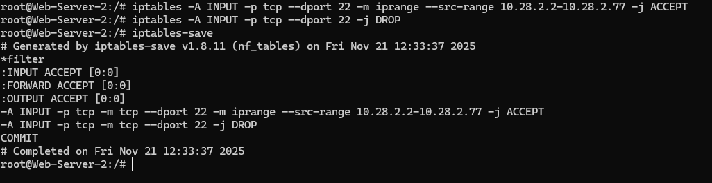

3. Hasil jika melakukan ssh root@10.28.2.162 (IP Web-Server-2) dan ssh root@10.28.2.128 (IP Web-Server-1) di IT-PC-1

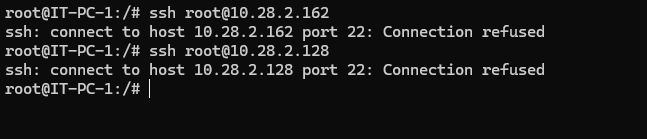

4. Hasil jika melakukan ssh root@10.28.2.162 (IP Web-Server-2) dan ssh root@10.28.2.128 (IP Web-Server-1) di router-5

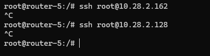

- Explanation

  `Semua langkah-langkah kurang lebih sudah ada di dokumen catatan ` [tertera](RevModul4.pdf)

 

## Soal 7

> Semua subnet hanya dapat mengakses semua DB-Server pada port 80 dan 443 (DB-Server-1 dan DB-Server-2) pada hari Senin-Sabtu, pukul 07:00- 22:00.

> _All subnets can only access all DB-Servers on ports 80 and 443 (DB-Server-1 and DB-Server-2) on Monday-Saturday, 07:00-22:00._

**Answer:**

- Screenshot

1. Yang dilakukan pada DB-Server-1

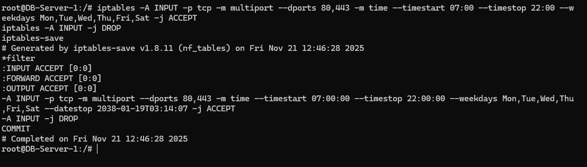

2. Yang dilakukan pada DB-Server-2

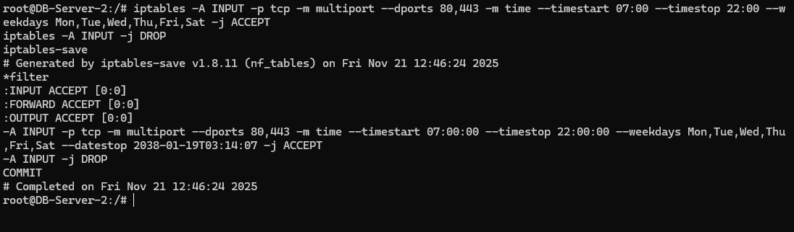

3. Hasil jika melakukan telnet IP DB-Server di port diatas pada IT-PC-1 jika di dalam jam dan hari yang diperbolehkan

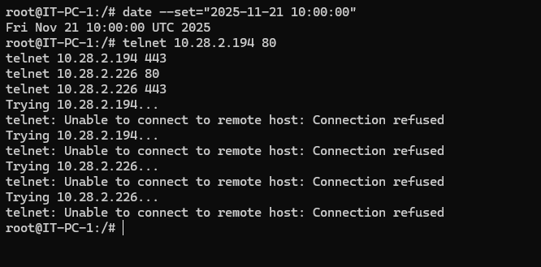

4. Hasil jika melakukan telnet IP DB-Server di port diatas pada IT-PC-1 jika di dalam jam dan hari yang tidak diperbolehkan

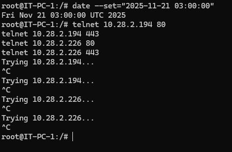

- Explanation

  `Semua langkah-langkah kurang lebih sudah ada di dokumen catatan ` [tertera](RevModul4.pdf)

 

## Soal 8

> Kemudian, buat agar “Web-Server-1” dan “Web-Server-2” hanya memperbolehkan traffic bertipe HTTP.

> _Then, make sure that “Web-Server-1” and “Web-Server-2” only allow HTTP type traffic._

**Answer:**

- Screenshot

1. Yang dilakukan pada Web-Server-1

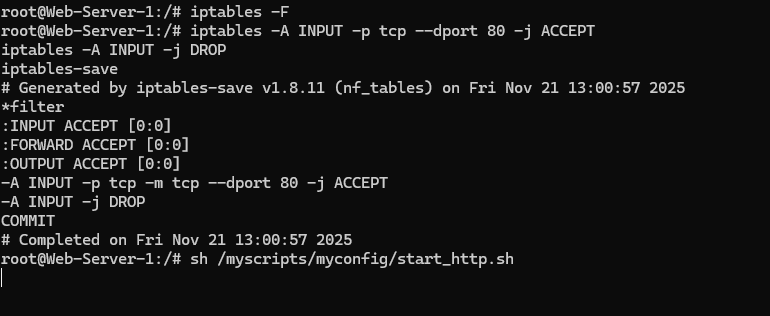

2. Yang dilakukan pada Web-Server-2

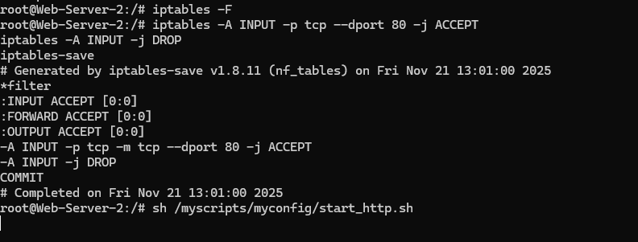

3. Hasil jika melakukan `curl -vL http://10.28.2.128` pada IT-PC-1

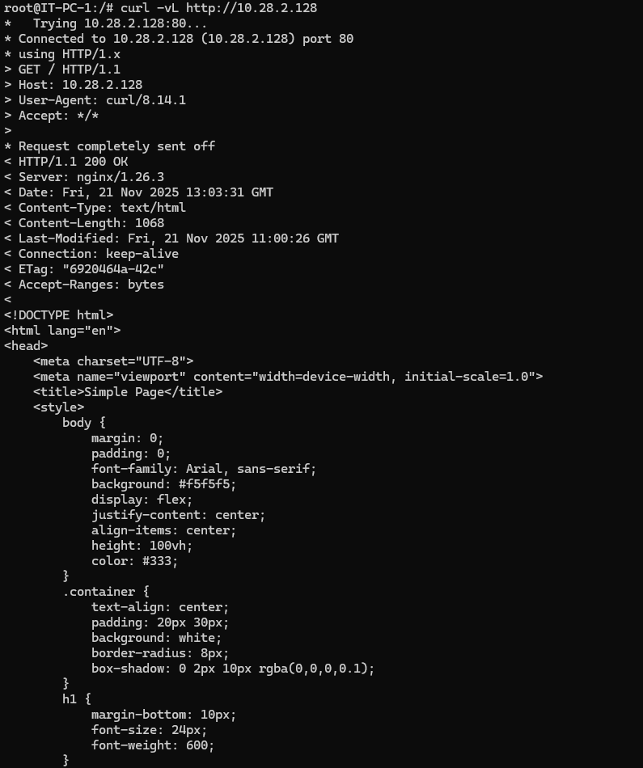

4. Hasil jika melakukan `ssh root@10.28.2.128` pada IT-PC-1

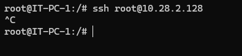

- Explanation

  `Semua langkah-langkah kurang lebih sudah ada di dokumen catatan ` [tertera](RevModul4.pdf)

 

## Soal 9

> Pilih salah satu Subnet dan lakukan blokir terhadap semua request protokol ICMP (ping) dari luar subnet terhadap subnet tersebut.

> _Select one of the Subnets and block all ICMP protocol requests (ping) from outside the subnet to that subnet._

**Answer:**

- Screenshot

1. Yang dilakukan pada router-5

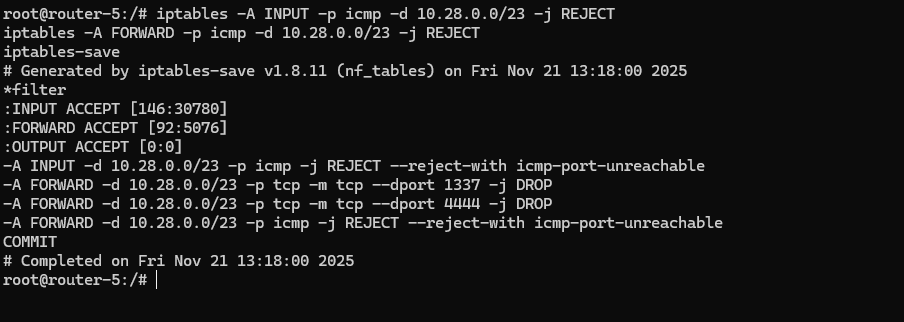

2. Hasil jika melakukan `ping [IP HR-PC]` pada IT-PC-1

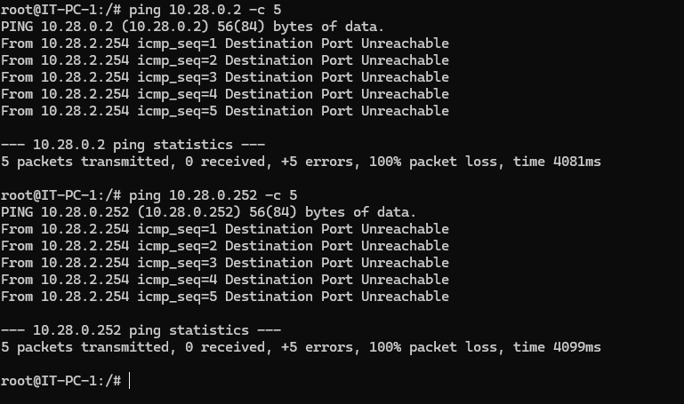

- Explanation

  `Semua langkah-langkah kurang lebih sudah ada di dokumen catatan ` [tertera](RevModul4.pdf)

 

## Soal 10

> Konfigurasikan fitur logging untuk melakukan log terhadap seluruh paket yang di-DROP pada lalu lintas setiap node.

> _Configure the logging feature to log all dropped packets on each node's traffic._

**Answer:**

- Screenshot

1. Isi dari IPTables pada Router-5

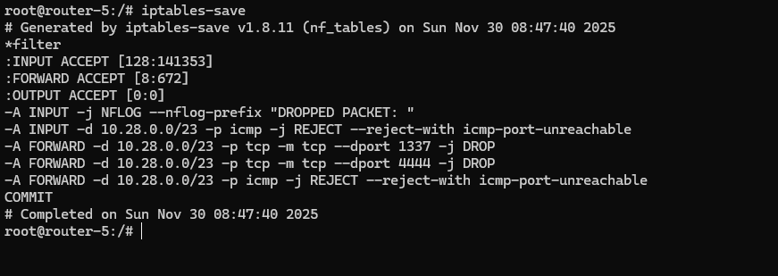

2. Melakukan test `ping` pada node IT-PC-1

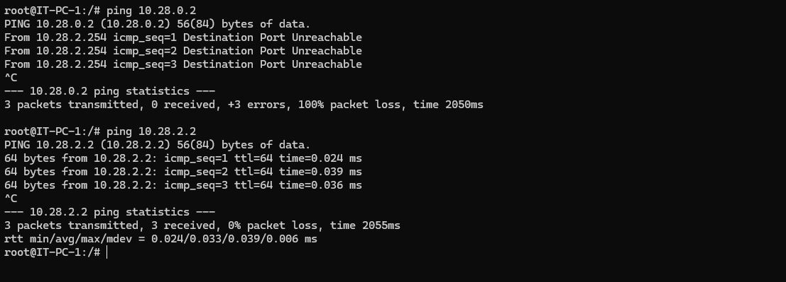

3. Isi dari `var/log/ulog/syslogemu.log` pada Router-5 setelah dilakukan testing

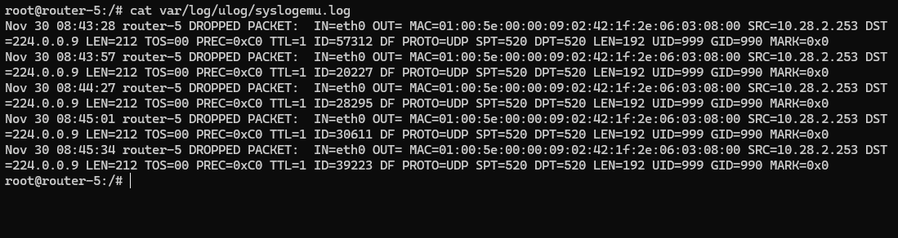

- Explanation

  `Semua langkah-langkah kurang lebih sudah ada di dokumen catatan ` [tertera](RevModul4.pdf)

 
  
## Problems

## Revisions (if any)
Menyelesaikan nomor 10
